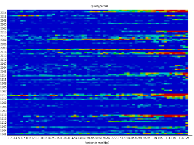
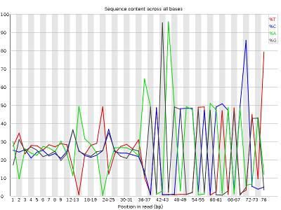
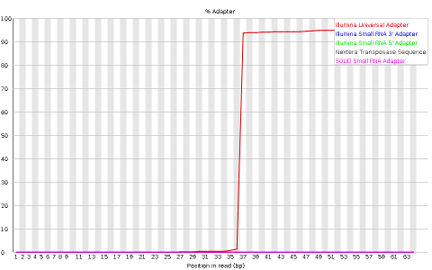

## <a id="LO3.1">3.1 - Interpret what are fastq files and what is their content</a>

Most high-throughput sequencing (HTS) machines output [fastq files](https://en.wikipedia.org/wiki/FASTQ_format), the “de facto” current standard in HTS. Fastq files are simply text files, where each block of information (a sequenced DNA fragment, or read) in this format is encoded as 4 lines:

	@read_identifier
	read_sequence
	+ separator line
	base_qualities

Each base has a quality character associated with it, representing how confidently the machine identified (called) the base. The probability of error per base is given as a [Phred score](https://en.wikipedia.org/wiki/Phred_quality_score), calculated from an integer value (Q) derived from the quality character associated to the base. Useful reference values of Q include:
* Q=10 - 90% accuracy
* Q=20 - 99% accuracy
* Q=30 - 99.9% accuracy
* Q=40 - 99.99% accuracy

Although there's theoretically no limit, Q usually goes up to around 40 in recent illumina machines.

You can see a few fastq files in the folder fastq_examples:
* sample_quality_and_adaptors.fastq.gz
* sample_adaptors.fastq.gz
* 20150821.A-2_BGVR_P218_R1.sample.fastq.gz
* 20150821.A-2_BGVR_P218_R2.sample.fastq.gz

Since each fastq can have several million reads, they can become very big. Therefore, it is usual to keep them in a compressed format such as gzip. Most recent software dealing with NGS data can directly read compressed fastq files.

**QUESTION**: Uncompress the file sample_adaptors.fastq.gz and open it in a text editor. What's the identifier and sequence of the first read of that fastq file?

Click Here to see the answer

The identifier is HWI-M01876:76:000000000-AF16W:1:1101:10853:1000. The sequence is NTGTACTTCATCCGAAACTCGTGCTCATCTCTGCTCAGATCGGAAGAGCACACGTCTGAACTCCAGTCACCGTGAT.

 

**QUESTION**: Uncompress the files 20150821.A-2_BGVR_P218_R1.sample.fastq.gz and 20150821.A-2_BGVR_P218_R2.sample.fastq.gz and open them in a text editor. What's the identifier and sequence of the first read of both fastq files?

Click Here to see the answer

The read identifier is the same for both files (HWI-D00418:83:C7G9GANXX:2:2108:16128:97655). This is because they are readings of the same fragment, one (_R1) in the forward and another (_R2) in the reverse direction. The sequences are different, as they are readings of different parts of the fragment, and of opposing strands.

 
 

## <a id="LO3.2">3.2 - Use software like FastQC to process fastq files and produce quality reports (QC)</a>

High Throughput Sequencing machines read thousands, or even millions of sequences in parallel. As you can imagine, this usually generates large fastq files, with millions of lines. Manually inspecting quality of each read is out of the question. Thus, specialized software has been developed to provide quality measures for fastq files generated by HTS machines. [FastQC](https://www.bioinformatics.babraham.ac.uk/projects/fastqc/) is a popular program to generate quality reports on fastq data. Running FastQC on your raw data is usually the first thing you should do once you receive a new dataset. FastQC is free and works on Windows, Mac and Linux.
 

**TASK**: Open a terminal. type `fastqc` and press enter. The graphical interface of FastQC should appear. Using the FastQC interface, open the file sample_adaptors.fastq.gz and the file sample_quality_and_adaptors.fastq.gz.

**QUESTION**: What information is in a FastQC report?

Click Here to see the answer

A FastQC report includes, among other things:

<ul>
  <li>Basic statistics of the fastq file, including number of reads and sequence length</li>

  <li>Per base sequence quality, displaying the boxplot distribution of the Phred Quality (Q) per base for all reads</li>

  <li>Per sequence quality scores displaying the histogram of the mean quality (Q value) of the bases of each read, for all reads</li>

  <li>Per base sequence content, displaying the frequency of each nucleotide at each position of the read</li>

  <li>Per sequence GC content displaying the histogram of the GC frequency of each read, for all reads</li>

  <li>Sequence length distribution displaying the histogram of read lengths</li>

  <li>Sequence duplication levels displaying the histograms of the number of times reads appear with exactly the same sequence</li>

  <li>Overrepresented sequences (not necessarily complete reads) that appear more frequently than randomly expected</li>

  <li>Adapter content indicaring the frequency of sequences of know sequencing adaptors along the length of the reads</li>
</ul>

 

FastQC reports provide a series of plots that allow the user to assess the overall quality of their raw data and detect potential biases and problems. Some plots indicate distribution of base qualities along the length of reads. You can notice that, at least for illumina data, on average the quality of each base tends to decrease along the length of the read. You can also see that the reverse read (R2) is usually of worse quality than the forward read (R1). Therefore, short single-end reads usually have better average quality, and are often ready to use right out of the sequencer.

Other plots indicate biases in nucleotidic content of reads, either globally (as %GC plots), or positionally. Global bias in nucleotidic content can be useful to search for signs of contaminants. On the other hand, positional bias are useful to detect presence of artefactual sequences in your reads such as adaptors. Another insight you may obtain from this information are potential biases in the preparation of your library. For example, random hexamer priming is actually not truly random, and preferentially selects certain sequences. The currently popular transposase-based enzymatic protocol, although reasonably random, is also not completely random, and you can see this through positional bias, particularly in the beginning of reads. The presence of adaptors is a relatively common event, and therefore specific plots exist to detect the presence of the most commonly used adaptors. Finally, the presence of repetitive sequences can also suggest contaminants, PCR artifacts, or other types of bias.

**QUESTION**: What are the main differences between the reports of sample_adaptors and sample_quality_and_adaptors?

Click Here to see the answer

The sample_quality_and_adaptors.fastq.gz file contains 10000 reads of 250bp, while the sample_adaptors.fastq.gz file contains 1000 reads of 76bp. The sample_quality_and_adaptors reads have a lower per base sequence quality at their end, while the reads of the sample_adaptors keep a good quality throughout.
 

The sample_adaptors reads contain a very noticeable nucleotide positional bias particularly after position 36. sample_quality_and_adaptors also contain a bit of nucleotide positional bias, but less and only for the first 10bp. The sample_quality_and_adaptors reads display an apparently bimodal GC distribution, while the sample_adaptors reads seem closer to a single normal distribution.

Finally, sample_adaptors contain a clear presence of a known Illumina adaptor after position 36 (probably the reason for the nucleotide positional bias we saw before), while sample_quality_and_adaptors contain a much smaller frequency of another Illumina adaptor (Nextera) towards the ends of the reads.

 

**QUESTION**: What is the major difference between the two paired fastq files of the paired_example?

Click Here to see the answer

The reverse read has poorer quality bases. This is usually the case, at least for illumina. This is because the reverse reads are generated after the forward reads.

 

**TASK**: Let's see now one simple example of the power of running tools using the command-line terminal. In a terminal window (it can be the same as you used to open fastqc, though you'll need to close the program), go to the folder fastq_examples using the `cd` command. Type `fastqc *.fastq.gz` and press enter. Inside the folder, you should now see a series of html files with FastQC reports of each of the fastq files. You can open them with the web browser by clicking on them with the mouse, or by running `firefox *.html`.

**NOTE**: Assess how well you achieved the learning outcome. For this, see how well you responded to the different questions during the activities and also make the following questions to yourself.

  * Do you understand the content of a fastQ file?

  * Did you understand the difference between single-end and paired-end reads?

  * Could you run FastQC on a fastq file?

  * Can you broadly list types of information that a FastQC report contains?

  * Can you interpret information in a FastQC report to detect potential issues with data in a fastq file?

 

### Back

Back to [first page](../index.md).
