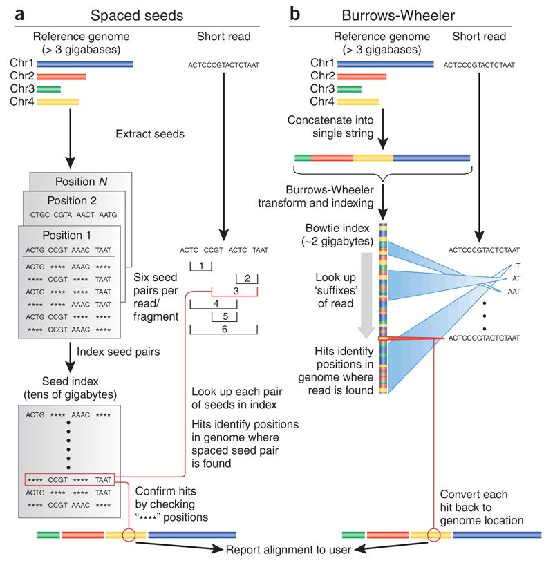
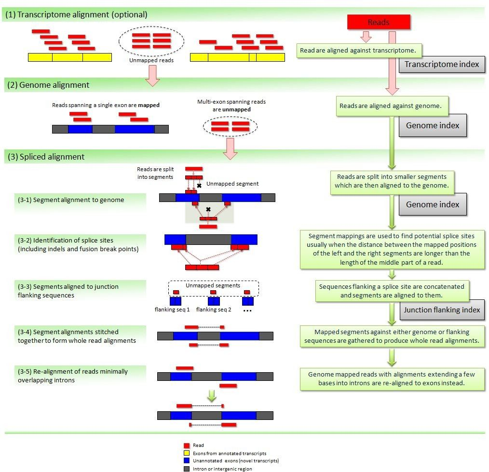

At this stage, we've checked the quality of our raw data and performed preprocessing if necessary, so we should now be ready to use it.

## <a id="LO5.1">5.1 - What is a reference genome, versioning and where to obtain genomes</a>

If the species we're using has had their genome assembled, we can now align the reads against the reference genome of our species. Genomes were (and still are) usually obtained through the efforts of large consortia, which eventually create portals making the data available for the scientific community. [ENSEMBL](http://www.ensembl.org) (in Europe) and the [UCSC genome browser](http://genome.ucsc.edu/) (in the US) emerged first as resources to display and explore the  data for the Human Genome Project, and latter agglomerated data for other model and non-model organisms, making them very convenient resources for high quality genomes.

Genome assemblies are continuously updated with new information, particularly for large eukaryotic genomes. Even the human genome, which was "completed" in 2001, is regularly being updated. More recent updates of the Human genome do not change the core sequence, but add for example alternative haplotypes for complex and highly variable regions such as the HLA. It is also very frequent to have several alternative genomes for the same species (eg. different lab strains of mice, or other model organisms).

Moreover, large genomes contain many repetitive elements, which are usually masked for secondary analysis like gene annotation. For the alignment of NGS data, it is usually recommended to use full, unmasked, sequences. It is also common to ignore alternative haplotypes, although this depends on the goals of the study.

Therefore, it is fundamental to keep track of the version of the genome used, as well as from where (and when) it was obtained. When performing analysis using resources like Galaxy, genomes are often already integrated and available for immediate use. You should always note as much information as possible about the genome you're using and, if in doubt, contact the service providers to find out missing information.

Finally, another alternative is to use transcript sequences (cDNA) directly as a reference. This is sometimes the only alternative, when full good quality genomes are not available. The presence of multiple alternative transcripts can make the alignment more difficult, but more recent approaches can actually take this information in consideration. We can also select collections of transcripts that are relevant for our analysis (eg. focusing on protein-coding mRNAs, and/or choosing a single representative transcript per gene).

**TASK**: Go to the [Ensembl](http://www.ensembl.org) website and obtain genomic fasta for Drosophila melanogaster (click on the Downloads tab on the top, and then on Download data via FTP). Also download a fasta with cDNA. See note below to understand what you need to download. Take note of the Ensembl version, as well as the version of your genome (in case later you want to integrate data that is not from Ensembl).

 

**Note**: In Ensembl you will see many genomic files to download. Particularly, you'll see 3 times what appear to be the same files, but with 'rm' and 'sm'. These are masked versions of the genome (rm - repeat masked, sm - soft masked), where repetitive regions of the genome are either replaced by 'N' (in the 'rm' versions) or as lower case (in 'sm'). Repeat masking is an important process particularly for genome annotation and other applications. In RNA-Seq analysis it is usually not recommended to use repeat masked versions. You may also see the sequences of chromosomes separately, but you usually want the full genome in one single file, usually indicated as 'toplevel'. In a few highly studied species, such as Human or Mouse, there may be several alternative sequences (haplotypes) for one same region of the genome. Unless one is specifically interested in these regions, we usually do not want these alternative regions, and therefore should take only the primary assembly. For any doubt, you can read the README file in the Ensembl FTP site.
 

**Note**: You need to register from where you obtained your genome, even if you know the version. For example, if you obtained your genome from UCSC, the chromosome names start with 'chr' (chr1, chr2, ...) while if you obtained from ENSEMBL, the chromosome names do not have 'chr'. Although seemingly innocent, it may make results obtained using UCSC and ENSEMBL genomes hard to integrate (even if made on the same version).  

 
 

## <a id="LO5.2">5.2 - Alignment software: hisat; bwa; salmon</a>

To be able to align millions of short reads to a (sometimes large) reference genome, novel, more efficient, alignment methods had to be developed. The most popular are based on the [burrows-wheeler transform](https://en.wikipedia.org/wiki/Burrows%E2%80%93Wheeler_transform), of which [bwa](http://bio-bwa.sourceforge.net/) and [bowtie](http://bowtie-bio.sourceforge.net/index.shtml) are examples. They enable alignment of millions of reads in a few minutes, even in a common laptop.  

Methods based on the burrows-wheeler transform make assumptions to speed up the alignment process. Namely, they require the reference genome to be very similar to your sequenced DNA (less than 2-5% differences). For example, mouse data will align poorly to the human genome, although in the case of RNA-Seq this is less problematic since genes tend to be much better conserved than the rest of the genome (you would probably still bias your results to better conserved genes). Moreover, these fast alignment algorithms are not optimal, and therefore sometimes make some mistakes, although they work quite well most of the time.

Eukaryotes contain the extra complication of splicing, where your read will be spread through multiple regions of the genome (usually, different exons of the same transcript). When using small, single-end reads, this is less of a problem, since it is less likely that your reads will overlap significantly with a splice site. Nonetheless, it is a good idea to use an aligner that allows split reads. [Hisat](https://ccb.jhu.edu/software/hisat2/index.shtml) (based on bowtie) is one such splice-aware aligner (it is an update of the better known Tophat aligner). It still uses the same approach as before, but with extensions to allow splitting of reads (i.e. different parts of a read may align in different places). Recent updates of bwa (bwa mem) also allow splitting of reads, and can be used for RNA-Seq data.

Finally, another set of more recent approaches quickly gaining in popularity map directly against the transcriptome, without the need for a reference genome. [Salmon](https://combine-lab.github.io/salmon/) provides transcript-level estimates of gene expression without explicitly generating alignments. These methods are very fast since they rely on sequence similarity (pseudoalignments) instead of perfect alignments, and because they only search against the transcriptome. Through the use of more elaborate statistical methods they also handle the presence of different alternative splice forms that cause difficulties in the attribution of a read to a transcript. Some of these methods, such as salmon, also take explicitly in consideration bias related to differences in transcript length and nucleotide composition.

 
 

## <a id="LO5.3">5.3 - Running an alignment. The SAM/BAM alignment format</a>

**TASK**: In Galaxy, run Hisat2 on the 20150821.A-2_BGVR_P218 R1 fastq file (in single-end mode) against the Drosophila genome that should be available in your Galaxy instance (you only need to set the parameter for input fastq and the genome).

**QUESTION**:: What's the result of running Hisat2

Click Here to see the answer

The result of Hisat is an alignment file in the BAM format.

 

The output of these aligners consist of SAM/BAM files. The [Sequence Alignment/Map (SAM) format](https://samtools.github.io/hts-specs/SAMv1.pdf) is a tabular text file format, where each line contains information for one alignment. SAM files are most often compressed as BAM (Binary SAM) files, to reduce space and allow direct access to alignments in any arbitrary region of the genome. Several tools (particularly the most recent ones) only work with BAM files. Some aligners still produce only SAM files, which may need to be converted to BAM.

**TASK**: Visualize the BAM you generated in Galaxy.

**QUESTION**:: What is the position of the start of the first alignment in the file you generated in Galaxy (when you visualize the BAM file in Galaxy it shows you the SAM information)?

Click Here to see the answer

The first line in the SAM file (after the long header section with the lines starting with '@') corresponds to the alignment of the sequence with the identifier HWI-D00418:83:C7G9GANXX:2:1314:11646:81987. It aligns in cromosome 2L, position 69393, in the reverse orientation (that's what the 16 in the second column means), with a mapping quality of 60.

 

The reads that do not align are also in the SAM file, but with information mentioning that they did not align the reference.

 

**QUESTION**:: In the description of the BAM file (result of Hisat2), you should see some text reporting a summary of the alignment. What's the overall alignment rate that is reported?

Click Here to see the answer

The overall alignment rate is 81.41%.

 

As we mentioned before, aligners for NGS data depend on large data structures for their efficiency. These structures (like the blast databases) are built from the fasta file containing the sequence of the reference genome. This process is relatively slow and computationally intensive, although it is only necessary to do it once for each reference genome. Therefore, before aligning your reads, it is necessary to do an indexing step on the genome sequence that will be used for alignment. If using the tools on the command line, one needs to explicitly perform this step.

 

**TASK**: Unzip the fasta file with the Drosophila genome that you downloaded (in the terminal, move to the folder where you downloaded the file and execute `gunzip Drosophila_melanogaster.BDGP6.dna.toplevel.fa.gz`. If you use the mouse to unzip, it may generate a strange name inside many folders, but it is the correct genome. If it is inside many folders, copy it to the folder where you downloaded the file. You may also want to rename it to the same name as the file you downloaded, but without the .gz. In the same folder where you have the unziped fasta file run the following command: `hisat2-build Drosophila_melanogaster.BDGP6.dna.toplevel.fa Drosophila_melanogaster.BDGP6.dna.toplevel.hisat2`.

**QUESTION**: After the command finished, can you see other files created in that same folder?

Click Here to see the answer

You can see several files, all starting with 'Drosophila_melanogaster.BDGP6.dna.toplevel.hisat2'. These contain the burrows-wheeler indexes that hisat2 will use to perform the alignment.

 

**TASK**: After the genome indexing step, you can now perform the alignment. Make sure the file 20150821.A-2_BGVR_P218_R1.sample.fastq.gz that is inside the fastq_examples folder is in the same folder as your genome index. Now, run the following command: `hisat2 -x Drosophila_melanogaster.BDGP6.dna.toplevel.hisat2 -U 20150821.A-2_BGVR_P218_R1.sample.fastq.gz > 20150821.A-2_BGVR_P218_R1.sample.fastq.gz.sam`.

 

This step generated a SAM file, containing the alignment information like we saw before, and which you can open using any text editor or spreadsheet.

 

**TASK**: We will now transform the SAM file into a BAM file. In the same terminal window where you indexed the genome and performed the alignment using Hisat, run `samtools view -Sb 20150821.A-2_BGVR_P218_R1.sample.fastq.gz.sam > 20150821.A-2_BGVR_P218_R1.sample.fastq.gz.bam`.

The BAM file contains exactly the same information as the SAM file, but compressed (like a zip file). Like the SAM file, the BAM file contains information on millions of alignments. For many applications, we need to efficiently extract the alignments in certain regions of the genome (eg. the genes). For this, we can create a BAM index (NOT to be confused with the genome index), which acts like yellow pages to efficiently direct software tools to alignments in specific regions of the genome.

 

**TASK**: To create the BAM index, the alignments in the bam file need to be sorted by position. For this, run `samtools sort 20150821.A-2_BGVR_P218_R1.sample.fastq.gz.bam 20150821.A-2_BGVR_P218_R1.sample.fastq.gz.sorted`. Finally, we can create the index `samtools index 20150821.A-2_BGVR_P218_R1.sample.fastq.gz.sorted.bam`. Notice now the appearance of a companion file 20150821.A-2_BGVR_P218_R1.sample.fastq.gz.sorted.bam.bai that contains the index. This file should always accompany its corresponding bam file, as programs will look for the existence of this file.
 

Using services such as Galaxy, the genome indexing step is hidden from the user. When performing the alignment in Galaxy, you usually have two options: either you provide a fasta with the reference genome, or you select an available pre-built genome. When using an available genome, the indexing step was already performed, while if you provide your own fasta of the genome, an indexing step will have to be performed before the alignment step. If your genome of interest is relatively large (roughly >100Mb), it is more efficient to have it pre-built, particularly if you're reusing it often. For this, you will need to ask the persons managing the service you're using. Moreover, the transformation from SAM to BAM and the BAM indexing steps are usually also transparent in Galaxy, where the user only sees the final result.

 

**TASK**: In Galaxy, run Hisat2 on the 20150821.A-2_BGVR_P218 R1 file (in single-end mode) like you did before, but using as genome the fasta for the Drosophila genome that you downloaded previously (you'll need to upload it into Galaxy). Compare the differences in the time it takes to run Hisat2.

**QUESTION**:: Which took longer: the one with the prebuilt genome index or the one where you passed the genome fasta?

Click Here to see the answer

The alignment using the prebuilt genome index took much less time, since the genome index was already generated.

 

Most genomes (particularly mamallian genomes) contain areas of low complexity, composed of repetitive sequences. In the case of short reads, sometimes these align to multiple regions in the genome equally well, making it impossible to know where the fragment came from. Longer reads are needed to overcome these difficulties, or in the absence of these, paired-end data can also be used. Some aligners (such as hisat or bwa) can use information from paired reads to help disambiguate some alignments. Information on paired reads is also added to the SAM/BAM file by most aligners when this data is used.

 

**TASK**: In Galaxy, run Hisat2 with the 20150821.A-2_BGVR_P218 example paired-end data against the prebuilt Drosophila genome. Use the trimmed versions that you generated before with Trimmomatic.

 

In the guilgur folder, you'll have data extracted from [Guilgur et al, 2014](https://elifesciences.org/content/3/e02181). In this Drosophila melanogaster dataset, we have two conditions (WT and mut), with two replicates for each (note that nowadays, it is more common to use 3 or more replicates). To make it quick to run, we have extracted data for a very limited set of genes. This data is already of good quality, ready to align.

 

**TASK**: In Galaxy, create a new empty history to avoid having too many datasets in the same history. Then, upload all R1 files from the guilgur folder (NOTE: when uploading to Galaxy, explicitly set their type to fastqsanger.gz). Next run Hisat2 on them using the Drosophila genome that is already prebuilt. After finishing, download all BAM files **and** their companion indexes (when clicking on the disk icon, you'll have two files to download, download them both).

**Hint**: You can rename an item in you history by pressing the Edit Attributes button . Renaming files may come in handy later.

 

**NOTE**: Assess how well you achieved the learning outcome. For this, see how well you responded to the different questions during the activities and also make the following questions to yourself.

  * Do you understand the concept of genome version, and where to obtain reference genomes?

  * Do you understand the need of a specialized alignment software to align millions of short RNA-Seq reads to a reference genome? Can you name at least one software that is often used for this task?

  * Could you use Hisat2 to align a RNA-Seq fastq file to a reference genome? Do you understand the basic steps involved in the use of Hisat2?

  * Do you understand what is a SAM and BAM file, the result of the alignment process?

 

### Back

Back to [first page](../index.md).
