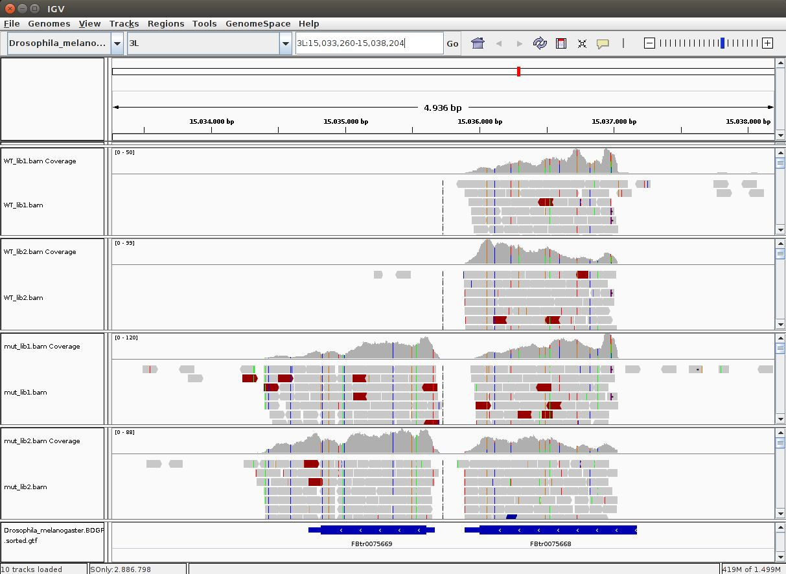
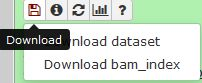
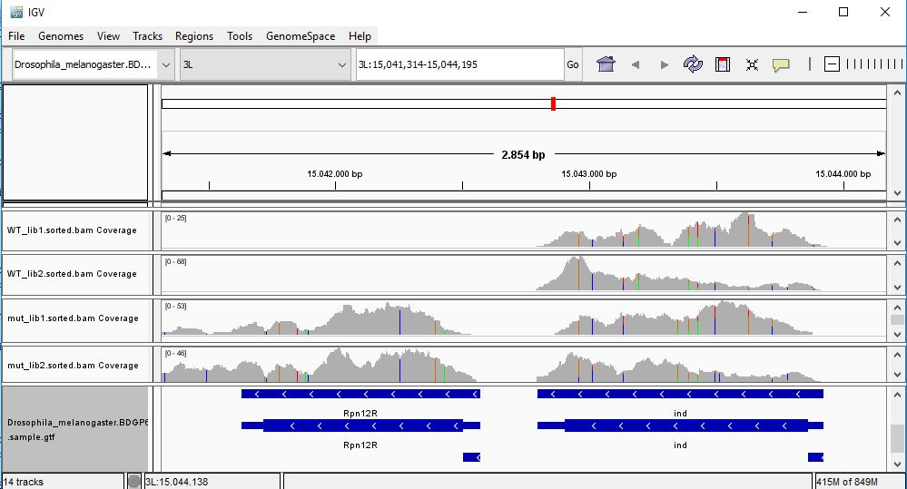
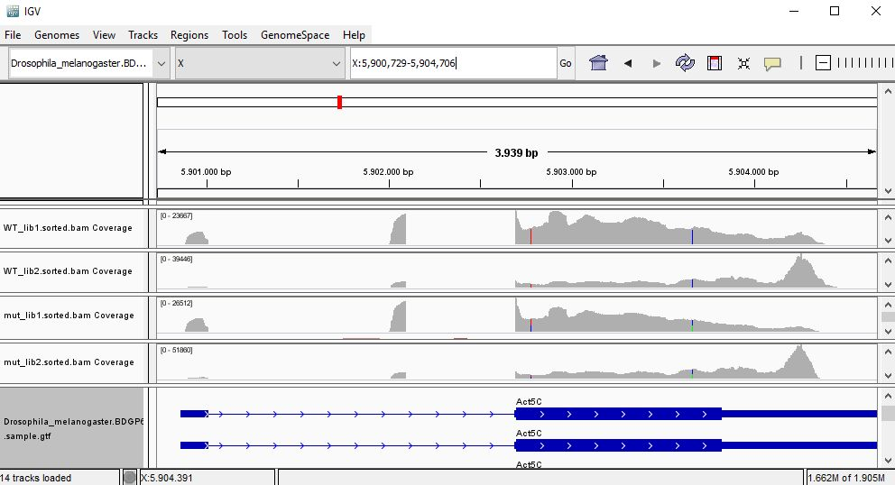
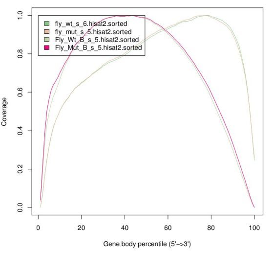
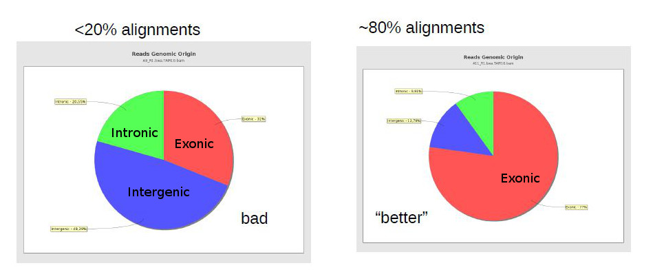

## <a id="LO6.1">6.1 - What is a reference gene annotation, versioning and where to obtain it</a>

To estimate gene expression, we need to define the genes by identifying their position in the genome. This information is stored in a hierarchical fashion (the genes, their transcripts, each transcript's exons, and so on...) in formats such as the [Generic Feature Format (GFF) files](http://gmod.org/wiki/GFF3). These consist basically of tabular text files with positions of genes (and their components) in the genome (for a specific genome version), as well as other information about the gene such as its name. Another common format used for annotations is the [BED format](http://genome.ucsc.edu/FAQ/FAQformat.html#format1).

Each gene annotation is deeply associated to one given version of the genome (because it contains positions in that genome), but the same genome version may (and usually has) several gene annotation versions. The same way one should keep in detail the version of the genome, we should also take note of the version of the gene annotation being used, and from where and when we obtained it. We also need to make sure we're using a gene version that is compatible with the genome version we used.

Gene annotations are usually complex to create, particularly for large mammalian genomes, and are a permanent work in progress (even more than the genome). Annotation of the Human genes is the work of several large groups of researchers. Other model organisms (such as the mouse) also have dedicated teams to curate their genes. Non-model organisms that are less intensively studied may suffer from having less well characterized annotations, frequently derived from other better studied organisms.

The same way Ensembl is a good source for the genome sequence, it is also a good source to obtain gene annotations. Ensembl even defined a specific derivative of the GFF format (the [GTF](http://www.ensembl.org/info/website/upload/gff.html) format) which is commonly accepted by most applications. Ensembl is updated roughly every three months. If you download the genome and gene annotation from the same ENSEMBL version, then you're sure to have compatible files, but be aware that in a few months the annotation (or even worse, the genome assembly) may change.

**QUESTION**:: Upload into Galaxy the sample GTF in the guilgur folder and inspect it (using the eye icon). What's the first gene described in the GTF?

Click Here to see the answer

It's the gene Rpn12R (common name), also known as FBgn0036465 (Flybase identifier), located in chromosome 3L, from positions 15041631 to 15042570, in the forward strand. You may notice a hierarchical structure, with genes having several transcripts, and each transcript having several exons.

 

**TASK**: Obtain the latest Drosophila melanogaster GTF from [Ensembl](http://www.ensembl.org), similarly as how you obtained the genome fasta file.
 

**Note**: Like for the genome sequence, you may see several gtf files in Ensembl. Abinitio genes are inferred insilico, and should be avoided, as they are prone to incorrections. Usually one takes the full gtf, although you can also take the ones associated to chromosomes (excluding unplaced scaffolds or alternative haplotypes).  
 

**Note**: The gtf in Ensembl contains all genes, including non-coding RNAs, pseudogenes, and many alternative splice transcripts. If you want just protein-coding genes, or a single representative for each gene (like RefSeq), then you may need to get it from places like the UCSC [Table Browser](https://genome.ucsc.edu/cgi-bin/hgTables). You will need to be sure to use a compatible genome version.

 
 

## <a id="LO6.2">6.2 - Visualizing alignments in IGV for single genes</a>

The SAM/BAM file contains all the information on the alignments, but it is not a practical way to visualize them for humans. To visualize the alignments along the reference genome one can use software such as [IGV](http://software.broadinstitute.org/software/igv/) or [Tablet](https://ics.hutton.ac.uk/tablet/), which work with the most common operating systems. To avoid loading all alignments simultaneously in memory, and to be able to quickly search for region-specific alignments, this software uses the BAM format (with indexes). With IGV we can have an overview of the alignments, which is particularly useful if we have specific genes of interest apriori. Usually, though, we use IGV after obtaining the final results, to confirm that certain genes (particularly important for our experiment) are really differentially expressed.

 

 

**TASK**: Download the BAM files you generated for the guilgur dataset in Galaxy . You also need to download the companion bai index files that accompany each of the BAM files. These bai index files are essential to quickly access alignments inside the BAM file. Run IGV and load the Drosophila genome fasta file as reference (in Genomes, load genome as file). 
Next load (in File, load file) the provided annotation file (Drosophila_melanogaster.BDGP6.85.sample.gtf - **not** the one you downloaded from ENSEMBL) inside the guilgur folder which contains information just for a subset of genes. Finally, load the BAM alignment files.
 

**Hint**: To run IGV, you can open a terminal, and type `igv`. It will then take a little bit to start.

**QUESTION**: In IGV, look at position: 3L:15041314-15044195 (alternatively, look for the gene Rpn12R, or Fbgn0036465). What can you see?

Click Here to see the answer

You can see that the gene is expressed (there are reads aligning) in the Mutant, but not in Wild Type control samples.

 

**QUESTION**: In IGV, look at position: X:20689286-20698941 (alternatively, look for the gene run, or FBgn0003300). What can you see?

Click Here to see the answer

You can see that the gene seems slightly more expressed in the Mutant, but more noticeable you see a splicing defect in the mutant that you don't see in Wild Type control samples.

 

**QUESTION**: In IGV, look at position: X:5898729-5908384 (alternatively, look for the gene Act5c, or FBgn0000042). What can you see?

Click Here to see the answer

That gene is highly expressed in all samples (much greater coverage than the other genes). Looking at the coverage along the gene, it seems that samples seem to cluster by replicates instead of their genotype, since in one group of replicates the reads seem to accumulate next to the polyA.

 

**QUESTION**: For the gene Act5c, expression profile seems to suggests samples are clustered by replicate insted of genotype. What may this be suggesting?

Click Here to see the answer

The accumulation of reads at the ends for one group of replicates suggests a batch effect caused by RNA degradation affecting more one group of replicates than the other, irrespective of the genotype associated to the samples.

 

**QUESTION**:  Would you be able to detect all of what you saw here using microarrays? If not, what and why?

Click Here to see the answer

You wouldn't be able to see unforeseen splicing defects or alternative transcript usage. You would also not be able to see mutations, which you can with sequencing data. It would also probably be hard to detect positional issues like we observed that suggest RNA degradation.

 
 

## <a id="LO6.3">6.3 - Assessing the quality of alignments</a>

After generating alignments and obtaining a SAM/BAM file, how do I know if this step went well? In fact, there are potential issues that we can only detect after we try to align against the reference genome.

One important general measure is how many (out of all reads) were properly aligned against the reference genome. In the case of bacterial sequencing one would expect >95% successful alignment, but when sequencing a mamallian genome (with many repetitive areas) it may be normal to have as low as 70-80% alignment success. RNA-Seq sequenced regions that are usually well preserved, and thus alignment rates should usually be high (more than 80-90%).

**QUESTION**:  Some aligners, such as Hisat, report the alignment rate. What were the alignment rates for the fastq files from the guilgur dataset?

Click Here to see the answer

The alignment rates were all very high (>=90%). This is because this is a selected set of reads. In the case of the example files 20150821.A-2_BGVR_P218_R1/R2.sample.fastq.gz (where reads were chosen randomly), alignment rates are around 80%, slightly higher after trimming and using paired information (which improves alignment).

 

A low alignment rate may be caused by several reasons: the reads may not have been properly quality filtered or may contain artefactual sequence (such as adaptors and polyA tails); there may be contaminants; or an inappropriate reference genome may have been used for alignment. It can be hard to find out if there were contaminations, unless we have an idea of the possible contaminants. Finally, if we didn't use the proper genome, but there is no closer genome available, then there is not much that can be done, except perhaps trying to change parameters in the alignment software to allow for more mismatches (although this may cause biases and an increase in wrong alignments).

Another measure that can be used is the percentage of reads with duplicates (aligning exactly to the same place in the genome). Usually, duplication levels higher than 20% are not a good sign (they're a sign of low amount of sample and PCR artifacts) but again, depends on what you are sequencing and how much. In RNA-Seq it is common to have a small set of genes highly expressed, leading to the presence of duplicates. The histogram of number of duplicates per read will often look bimodal, with most reads being unique and a small subset highly duplicate (mostly from highly expressed genes). Unfortunately it is hard to distinguish PCR artifacts from highly expressed genes. When looking in IGV, PCR artifacts can be easily detected by an uneven coverage of the gene, and the presence of large stacks of duplicated reads. To be safer, one can remove duplicates, but this is not usually done in RNA-Seq, since a lot of valid information may be lost.
 

**Note**: One way of checking is to plot the number of duplicate reads by gene. If even low expressed genes have a lot of duplicated reads, then this is a sign that your sample may have problems, and you may need to try to remove duplicates.

 
There are reports specific for RNA-Seq which depend on gene annotation. One report indicates how well the genes are covered by sequence, which provides a good indication of RNA integrity. One can also check how well the alignments match the known annotation. The presence of a lot of alignments outside annotated genes can mean several things: annotation is not correct (eg. if you're working with a non-model organism); there can be DNA contamination (homogeneous presence of reads in both introns and intergenic); or presence of immature RNA (more intronic, less intergenic).

 

 

The same way FastQC generates reports of fastq files to assess quality of raw data, there are programs that generate global reports on the quality of BAM alignments. One popular tool for this is [qualimap](http://qualimap.bioinfo.cipf.es/).

**TASK**: In the command line, type `qualimap`. There may be some warnings about missing packages, don't worry about those. From the Qualimap GUI, produce Rna-seq reports (File>New Analysis>RNA Seq QC) using the BAM files of the guilgur dataset. You'll need to use the example gtf file as an annotation.
 

**QUESTION**: What information is in a Qualimap RNA-Seq report?

Click Here to see the answer

A Qualimap report includes, among other things:

<ul>
  <li>Number of aligned/mapped reads and other global statistics</li>
   
  <li>Genomic origin of the reads (whether they map to exons, or introns, or intergenic regions)</li>

  <li>Coverage along the genes (to identify possible positional bias)</li>

</ul>

 

**QUESTION**: Can you see differences in the Qualimap reports of the different samples?

Click Here to see the answer

The Genomic origin indicates reads as being mostly exonic, although in the case of the mutant samples there is a slightly larger proportion of intronic reads. Although we know that mutant samples have splicing issues, this is not very noticeable here because the plot is dominated by highly expressed ubiquitous genes that are also of maternal origin (and thus do not have splicing issues). The greatest difference is in the plot for the coverage along the gene, but surprisingly (or not, given what we saw in IGV), the difference is between the replicates and not between genotypes. As we saw before, the libraries for the second replicate seem to have greater degradation, and thus reads get concentrated towards the polyA tail ("end" of the gene). Also note that this plot is highly dominated by the highly expressed gene Act5C.

 

**Note**: If you see many reads in intergenic regions, this may be a sign of DNA contamination. One can estimate global contamination by calculating a mean coverage in intergenic regions.
 

**TASK**: Run qualimap using the command line, using the command:`qualimap rnaseq -bam mut_lib1_R1.bam -gtf Drosophila_melanogaster.BGP6.85.sample.gtf` (you may need to adjust the file names and locations). You should see a new folder created, containing the qualimap report in html format.
 
 

**NOTE**: Assess how well you achieved the learning outcome. For this, see how well you responded to the different questions during the activities and also make the following questions to yourself.

  * Do you understand the concept of genome annotation, that they are versioned, and where to obtain them?

  * Can you mention measures to evaluate the quality of your RNA-Seq alignments?

  * Could you run Qualimap to assess the quality of your RNA-Seq alignments?

  * Could you understand the output of Qualimap? Could you use it to identify potential issues in your experiment?

 

### Back

Back to [first page](../index.md).
