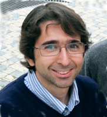
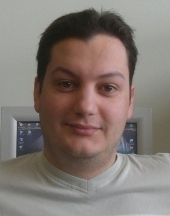
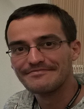

## Daniel Sobral
**Affiliation:** Instituto Gulbenkian de Ciência, Oeiras, PT

  

**Daniel Sobral** graduated in Informatics Engineering from Instituto Superior Técnico (Lisbon, Portugal). His interest in Biology led him to join the Gulbenkian PhD programme, and conduct his doctoral studies in Bioinformatics at the Université Aix-Marseille (France) with Dr. Patrick Lemaire. 

During his PhD he worked in different aspects of bioinformatics, particularly focusing on gene expression networks underlying embryonic development of a model organism, all of this integrated into a community resource. Later he became a Developer for the Ensembl Project where he worked mostly in integrating epigenetic data from the ENCODE project in Ensembl. In this context he gained significant experience with high throuthput sequencing data. 

In 2012 he moved back to Portugal, where he joined the Bioinformatics Unit at the IGC to assist the local research community in handling the sequencing revolution brought about by high throughput technologies. Within this role he been collaborating in several projects, ranging from genomics, transcriptomics and epigenetics. He has become the Head of the Bioinformatics Unit at IGC since 2014. 

---

## Daniel Faria
**Affiliation:** Instituto Gulbenkian de Ciência, Oeiras, PT

 
 
**Daniel Faria** graduated in Biological Engineering from Instituto Superior Técnico (Lisboa, Portugal). His interest in Bioinformatics led him to pursue a PhD on that topic, at the Faculdade de Ciências da Universidade de Lisboa (Lisboa, Portugal) under Dr. André Falcão and Dr. António Ferreira, focusing on automated protein function prediction and on the usage and structure of the Gene Ontology. He developed applications for computing semantic similarity between genes and for enrichment analysis, based on the Gene Ontology. 

After his PhD, his research interests veered towards knowledge representation and integration in Biomedical Sciences, and particularly the topic of Ontology Matching. 

He remained at the Faculdade de Ciências as a post-doc to pursue this research topic, and became a leading expert on it by developping the tool AgreementMakerLight. In 2015, he joined the Bioinformatics Unit at the IGC as a post-doc on the EXCELERATE project, to work on the integration and annotation of plant phenomic data.

---

## Daniel Neves
**Affiliation:** Instituto Gulbenkian de Ciência, Oeiras, PT

**Daniel Neves** is a bioinformatics specialist at the Bioinformatics Unit (UBI) at IGC. He has a bachelor's degree in Computer Engineering, and a MSc degree in Computational Biology from Faculdade de Ciências da Universidade de Lisboa (Lisboa, Portugal). In his MSc project, that was supervised by Luisa Figueiredo and Nuno Barbosa-Morais at Instituto de Medicina Molecular (Lisboa, Portugal), he used RNA-seq to unveil the circadian clock of Trypanosoma brucei, an ancient human pathogen. 

He has significant experience in Next Generation Sequencing (NGS) data analysis, having collaborated in the design and analysis of a wide variety of transcriptomics, epigenetics and genomics experiments. He is particularly interested in how visualization can help understand large datasets, avoid mistakes and uncover relevant information. At the IGC, he is currently responsible for providing consultancy and bioinformatics support within the BioData.pt infrastructure.

 

### Back

Back to [main page](../index.md).
