# Introduction

In [Han, Xiaoping, et al. "Mapping the mouse cell atlas by Microwell-seq." Cell 172.5 (2018)](https://doi.org/10.1016/j.cell.2018.02.001) a scRNA-seq dataset of approximately 400,000 cells isolated from all major mouse organs was generated by Microwell-seq. Expression matrices for all samples are available [here](https://figshare.com/s/865e694ad06d5857db4b).

In the previous section of this course we processed the raw fastq files for a sample of cells from mouse lung in order to obtain an UMI count matrix for all mouse genes. Because we don't know how many cells are really in the sample, we constructed a matrix containing the most abundant 10,000 barcodes.

In this tutorial we will perform the steps necessary to go from the raw expression matrix to a list of clusters representing transcriptionally distinct cell sub-populations and a list of marker genes associated with each identified cluster using the web-application D-cellerate.

## D-cellerate

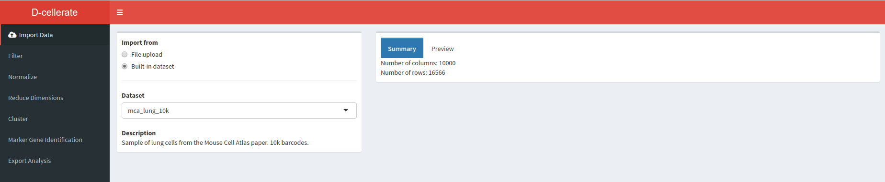

One of the most popular and widely used packages for scRNA-seq analysis is called *Seurat* (https://satijalab.org/seurat/). It is an *R* package that contains functions to perform filtering, quality control, normalization, dimensionality reduction, clustering and differential expression analysis of scRNA-seq. However, its use requires some knowledge of the *R* programming language, and thus can be difficult for non-experts.

To alieviate this problem, we are developing a web-application that exposes most *Seurat* functions in a user-friendly and interactive way.

To launch the application open the file _app.R_ in the D-cellerate directory using RStudio, and press "Run App" in the top right corner. Alternatively you can launch the application by running the following commands on the terminal.

```
cd ~/Desktop/singlecell_practical/D-cellerate
Rscript -e "shiny::runApp(launch.browser=TRUE)"
```

# Loading the raw UMI matrix

First we load an UMI matrix to analyse. In this tutorial we are going the lung sample previously described. For convenience it is available as an built-in dataset into the application.

In the **Import Data** section, select **Built-in dataset** and choose the ""*mca_lung_10k*"" dataset. On the right pane the *Summary* tab shows the number of columns (barcodes) and rows (genes) in the dataset.

**Question**: How many genes and barcodes are quantified in this raw UMI matrix?

<details><summary><b>Click Here to see the answer</b></summary> 16566 genes and 10000 barcodes. </details>

# Filtering the matrix

Move to the **Filter** section by selecting it in the left pane.

On the right we find the **barcode plot** that shows the total number of UMI counts per barcode in the raw UMI matrix (as we have seen in the *Cellranger* analysis).

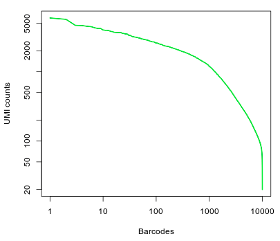

**Question**: What can you conclude from the above representation? How many of the top barcodes would you keep for further analysis?

<details><summary><b>Click Here to see the answer</b></summary>

There appears to be a drop in the total number of UMI counts after the first 1,000 barcodes. However, unlike what we saw in the 10x dataset, the separation between an empty GEM and a GEM containing a cell is less clear. This could be due to the presence of ambient RNA in the sample.

In the original study, taking into account the full set of 91 samples, the authors selected a threshold of 500 UMI counts to select barcodes for further analysis. Thus we are left with 2684 cells for further analysis.

</details>

To discard barcodes with less than 500 total UMI counts, enter **500** in the **Min UMI** field on the left pane. The barcode plot will display the cutoff line for barcode selection.

We can also filter barcodes based on the number of genes detected (i.e. the number of genes with at least one count). Enter **50** in the **Min Genes** field.

Next we inspect the distributions of total counts per cell (nUMI), and number of genes detected per cell (nGene). Click on the **Distributions** tab.

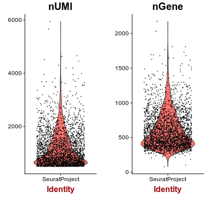

**Question:** Examine the distributions. What cells, if any, would you remove from the analysis?

<details><summary><b>Click Here to see the answer</b></summary>

For most barcodes we are able to detect approximately 500 genes. Barcodes with a much higher than average number of detected genes may indicate a multiplet (multiple cells in the same droplet), so we will also remove barcodes with more than 1500 genes detected.

</details>

Set **Max Genes** to **1500**.

Next we calculate the percentage of mitochondrial RNA in each cell.In *Mus musculus*, genes encoded in the mitochondria have names that start with "mt-" (e.g. mt-Atp6, mt-Nd1, ...).

Enter the expression **mt-** in the **Pattern for mitochondrial genes** box. Notice that 13 genes are found.

Open the **Distributions** tab again. Notice the new violin plot displaying the percentage of mitochondrial RNA in each cell.

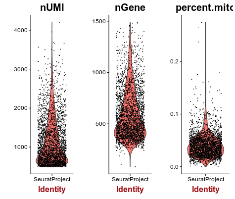

A few cells display higher than 10% abundance of mitochondrial RNA.

**Question:** What is a possible explanation for a high percentage of mitochondrial RNA in a scRNA-seq cell?

<details><summary><b>Click Here to see the answer</b></summary>

A high percentage of mitochondrial RNA usually indicates a dead or burst cell, as cytoplasmic RNA is lost while mitochondrial RNA remains protected.

</details>

Set the **Max Mitochodrial RNA Ratio** to **0.1**. Then open the **Summary** tab and verify that **2611** barcodes and **12962** pass the selected filters. This will be the matrix that will be used for further analysis.

# Normalization

Switch to **Normalization** tab.

Normalization of scRNA-seq is the focus of active research, and many complex techniques are being investigated. By default *Seurat* does a simple normalization to the total counts per cell. This normalization assumes that the total amount of RNA molecules in each cell is similar. It also log-transform the UMI counts and scale them to the median UMI counts across all cells.

# Dimensionality reduction

Because of the high-dimensionality of scRNA-seq datasets, it is common to reduce this dimensionality using various techniques. This will not only make computations faster (or in some cases *feasable*), as well as reduce noise in the data.

Switch to the **Reduce Dimensions** tab.

## Variable gene detection

Housekeeping genes that are similarly expressed in all cell populations are not useful for the purpose of identifying these populations. Thus, although this is an optional step, it is often useful to select a subset of genes that display higher than average variability among cells to be used for dimensionality reduction and clustering of cells, as this will greatly speed-up the computations.

The `FindVariableGenes` function from the *Seurat* package does this by selecting genes that display a variance/mean ratio above a user-supplied threshold.

Thresholds for the selection of variable genes are usually set manually by inspecting this variance/mean plot.

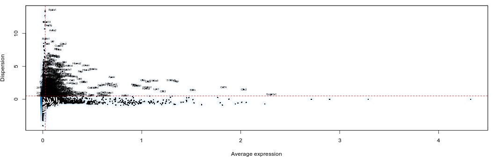

Here we select genes that have a dispersion more than 0.5 standard deviations above the average dispersion of genes with a similar expression level. We also set thresholds for minimum mean expression and maximum mean expression.

Set the **Expression min** to **0.025**. We should have 920 genes selected.

## Principal component analysis

In *Seurat*, principal component analysis (PCA) is done on scaled expression data (i.e. z-scores). The `ScaleData` function performs this step, and also allows to regress out common sources of technical variation, such as the total UMI counts per cell or the percentage of mitochondrial RNA.

PCA can be done on the full set of genes, or using variable genes only. Here we will use the 920 variable genes. Make sure **Genes to use** is set to **Variable genes**. Also check both **Regress nUMI** and **Regress percent.mito**.

We can also select how many principal components (PCs) we want to compute. This will not affect the end results, but the more you ask, the longer the computation will take. Here we leave at 40, but for very big datasets (with 10,000 or more cells) a larger number of PCs may be useful.

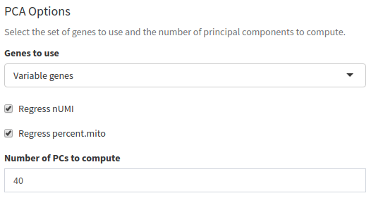

Now switch to the PCA tab. After the computation is finished a PCA *scree plot* will be displayed, showing the proportion of variance explained by each component.

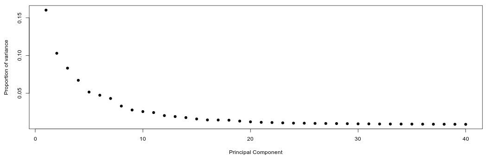

We want to determine how many PCs are useful for the purpose of clustering the cells. We are looking for a "knee" in the plot, where additional PCs do not bring much more new information.

**Question**: Based on the above plots, how many principal components would you consider for further analysis.

<details><summary><b>Click Here to see the answer</b></summary>

There is a drop in the percentage of variance explained after PC15 and the plot seems to reach saturation after approximately 20 PCs. Thus, 15 to 20 PCs seem to be adequate for this dataset.

</details>

Below the *scree plot* scatterplots of the principal component analysis can be visualized. Each point represents the loadings of two component of a single cell. Immediately we notice that cells are well spread out, which indicates an heterogeneous cell population.

We will re-examine these plots at a further time.

## t-distributed Stochastic Neighbor Embedding

t-distributed stochastic neighbor embedding (t-SNE) is a nonlinear dimensionality reduction often used in scRNA-seq analyses to visualize cell subpopulations. It is used to embed high dimensional scRNA-seq expressions in a 2D or 3D plot. Its main advantage compared to PCA is its ability to detect structures in the data that cannot be found by simple rotations (see [t-SNE: What the hell is it?](https://constantamateur.github.io/2018-01-02-tSNE/)).

Although useful to visualize single cell data, care should be taken when interpreting its results:

- t-SNE is an iterative stochastic algorithm. This means that it will produce different results each time it is run.
- Because t-SNE *does not preserve distances*, one should not over-interpret the higher order structures of the plot. i.e. just because two clusters appear close toghether on the plot, does not mean they are similar.
- The t-SNE algorithm is sensitive to the choice of its *perplexity* parameter. This parameter determines what the algorithm considers to be neighboring points. i.e. the number of neighbors of each point is roughly equal to the specified perplexity.

Read more about t-SNE:

- [t-distributed stochastic neighbor embedding (Wikipedia)](https://en.wikipedia.org/wiki/T-distributed_stochastic_neighbor_embedding)
- [How to Use t-SNE Effectively](https://distill.pub/2016/misread-tsne/)

For scRNA-seq datasets, a `perplexity` value in the range of 20 to 50 usually produces good results.

Although t-SNE can be run on the normalized expression matrix, it is common to use a reduced dimensions table to speed up computation.

Switch to the **t-SNE** tab. The following plot should appear.

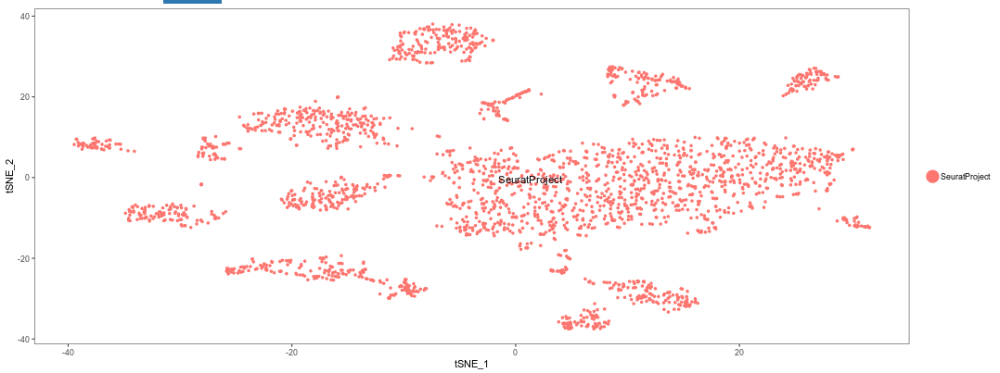

**Question**: Try using different numbers of principal components (e.g. 5, 10, 20, 40). What impact does it have on the t-SNE visualization?

<details><summary><b>Click Here to see the answer</b></summary>

A low number of PCs (below 10) means less information is available about each cell. Thus the cell population do not separate clearly on the plot. Conversely, using more than 20 PCs does not seem to have much impact on the results.

</details>

**Question**: Try using different values of perplexity (e.g. 5, 10, 20, 50, 100). What impact does it have on the t-SNE visualization?

<details><summary><b>Click Here to see the answer</b></summary>

Lower values of perplexity produce larger numbers of small clusters, while high value produce smaller number of bigger clusters.

</details>

**Question**: Try changing the RNG seed. What impact does it have on the t-SNE visualization?

<details><summary><b>Click Here to see the answer</b></summary>

Each seed will produce a completely different arrangement of t-SNE clusters. However, the number and sizes of clusters should be roughly the same.

</details>

**Important**: Make sure to reset the t-SNE options to 20 PCs, 30 perplexity and 42 as the RNG seed before proceeding.

# Clustering

Now move to the **Cluster** section.

Because of the high dimensionality of scRNA-seq datasets, clustering algorithms face a number of challenges, such as high computation times and memory requirements. To alleviate these problems, one solution is to perform the clustering using the cells PCA scores instead of the full expression matrix, where each principal component represents the signal of a correlated set of genes. Based on the analysis above, we are going to proceed using 20 PCs.

`Seurat` uses a graph based clustering algorithm where the `resolution` parameter influences the granularity of the clusters, with higher values producing more and smaller clusters.

On this dataset, using 20 PCs and a resolution of 0.8 produces 14 clusters of various sizes.

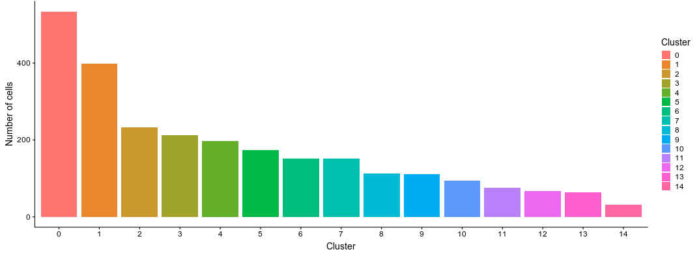

Click on the PCA tab. Here we can visualize the PCA scatterplots again, but this time cells will be colored according to the cluster they belong to.

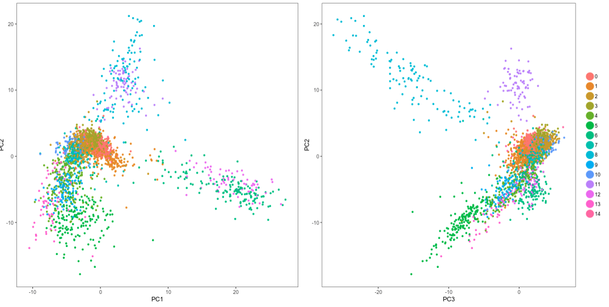

**Question**: Notice the cells on the cells on the top part of the plots. What do you observe?

<details><summary><b>Click Here to see the answer</b></summary>

It is clear from the plots that PCs 1 and 2 do not distinguish the purple and cyan clusters. However PC3 clearly separates these cells.

</details>

Click on the **t-SNE** tab. As with the PCA visualization, the t-SNE now shows the clusters.

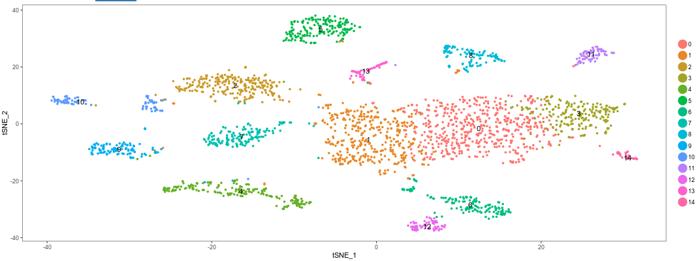

**Question**: Remembering that a t-SNE projection and the clustering algorithm that we used are based on completely distinct concepts, what do think of the results we got?

<details><summary><b>Click Here to see the answer</b></summary>

The clustering results fit very well with the t-SNE projection. This is an indication of a robust dataset.

</details>

**Question**: Try different values of the **Resolution** parameter used for the clustering algorithm. Also try using more or less PCs. What do you observe?

<details><summary><b>Click Here to see the answer</b></summary>

Smaller values of resolution produce larger clusters, while high values produce a more refined clustering. Sometimes this results in *over-clustering* of the cells.

</details>

**Important**: Before proceeding set the **Resolution** to **1.2** and the number of PCs to **20**.

# Marker gene identification

Move to the **Marker gene identification** tab. The program will start performing the computation of marker genes.

Seurat implements several methods for the discovery of cluster marker genes (differential expression). By default it uses two sample Wilcoxon tests, which for large datasets scRNA-seq with many cells has been shown to perform well. To speed up the computation, we will not test all genes, but only those that are detected in at least 25% of the cells in either population (the tested cluster or the combination of all other clusters) and have at least 0.25 log fold-change difference between the two populations.

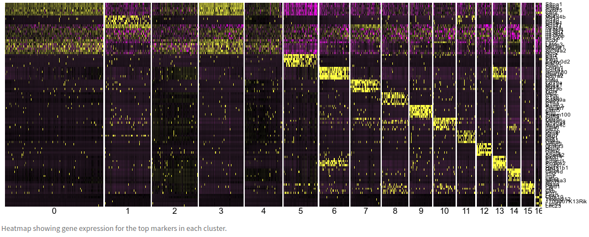

The markers heatmap displays the expressions of the top 6 marker genes identified in each cluster.

**Question**: Observe the clusters 0, 2, 3 and 4. Also go back to the t-SNE plot in the clustering tab and look where those clusters are embedded. What do you conclude?

<details><summary><b>Click Here to see the answer</b></summary>

The expression of the top markers of these 3 clusters is very similar. Additionally, in the t-SNE projection these 4 clusters are all part of large group cells without clear separation.

This suggests that these clusters are the result of *overclustering*, and they may in fact represent the same type of cell.

</details>

The table below the plot shows the data for all identified markers (using a threshold of adjusted p-value < 0.01). Use the search box to look for the gene *Sftpa1*. Notice that this gene was identified as marker gene for all 4 clusters above.

Click on **Visualize Markers**. A plot will be displayed showing the expression of gene *Sftpa1* projected on the t-SNE embeddding.

This is the top marker for cluster 0. We can add other genes to the plot using the **Genes** box. Add the next three markers. You should get the following image.

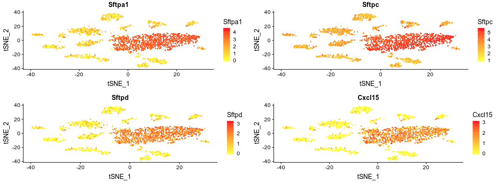

Again we see that these markers are expressed in all cells of central group. We can also visualize the expression of these markers in violin plots by changing the plot type.

# Fixing the Clustering

Go back to the **Cluster** tab and check the box "Rename/Merge clusters". We can now change the names of the clusters. Also, by giving the same name to multiple clusters, these will be considered as single one.

Change the name of clusters 0, 2, 3 and 4 to "Big". We have now merged those clusters into a single one.

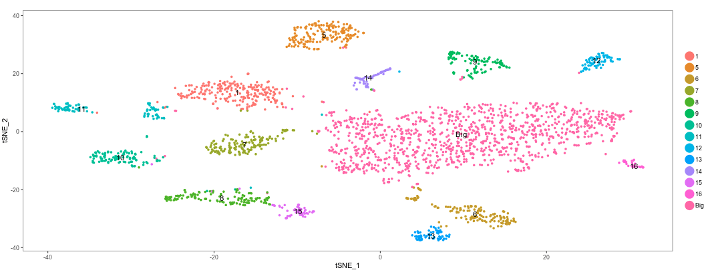

Return to the **Marker gene identification** tab. Because we have now changed the clustering, the program will re-calculate the marker genes.

# Annotating clusters

Now that we have a clear set of clusters and marker genes associated with each cluster, we may start annotating these clusters, by trying to identify what cell types are associated with each cluster.

Some cells have well known markers. For example, the gene Ms4a1 is a marker for B-cells.

**Question**: Can you identify which cluster represent B-cells?

<details><summary><b>Click Here to see the answer</b></summary>

By searching the table we see that Ms4a1 is a marker for cluster 7. We can rename this cluster as T-Cells.

</details>

Through the inspection of the top markers identified in each cluster one may begin manually annotating remaining clusters. This is a time consuming and difficult process.

Tomorrow, we will see how functional analysis can also help in the process of identifying cell types using the full set of marker genes in each cluster.

# Conclusion

Below is figure 4A from the mouse cell atlas.

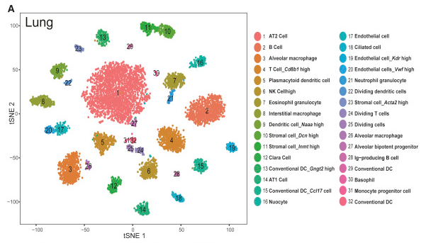

In the alternative exercise, where we used *Seurat* directly in *RStudio* we compared the results we obtained with the assigned cell types in the original study.

The figure below shows the t-SNE projection we obtained, with cells colored according to the clusters identified in the original study, showing we were able to reproduce quite accurately the results of the study.

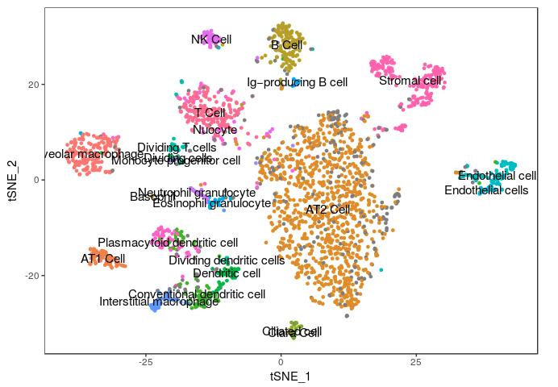
