## Introduction

In [Han, Xiaoping, et al. "Mapping the mouse cell atlas by Microwell-seq." Cell 172.5 (2018)](https://doi.org/10.1016/j.cell.2018.02.001) a scRNA-seq dataset of approximately 400,000 cells isolated from all major mouse organs was generated by Microwell-seq. Expression matrices for all samples are available [here](https://figshare.com/s/865e694ad06d5857db4b). 

In the previous section of this course we processed the raw fastq files for a sample of cells from mouse lung in order to obtain an UMI count matrix for all mouse genes. Because we don't know how many cells are really in the sample, we constructed a matrix containing the most abundant 10,000 barcodes. 

In this tutorial we will perform the steps necessary to go from the raw expression matrix to a list of clusters representing transcriptionally distinct cell sub-populations and a list of marker genes associated with each identified cluster. 

<br/>

## Libraries

First we load a few packages. `Seurat` is one of several packages designed for downstream analysis of scRNA-seq datasets. It implements functions to perform filtering, quality control, normalization, dimensional reduction, clustering and differential expression of scRNA-seq datasets. `gridExtra` is used to group multiple plots together in a grid.


```{r}
library(Seurat)
library(gridExtra)
library(ggplot2)
library(reshape2)
```
<br/>

## Loading and filtering the raw UMI count matrix

First we load the raw UMI matrix into the R environment. This should take approximately 30 seconds.


```r
mat.raw <- read.table(gzfile("matrices/lung1_full_hisat2.dge.txt.gz"), header=TRUE)
rownames(mat.raw) <- mat.raw$GENE
mat.raw <- mat.raw[, -1]

dim(mat.raw)
```

```
## [1] 16566 10000
```

**Question**: How many genes and barcodes are quantified in this raw UMI matrix? 

<details><summary>Click Here to see the answer</summary> 16566 genes and 10000 barcodes. </details>

---

Next we plot the total number of UMI counts per barcode in the raw UMI matrix. 


```r
umi.per.barcode <- colSums(mat.raw)
x <- sort(umi.per.barcode, decreasing = TRUE)
plot(x, log="xy",type="l", xlab="Barcodes", ylab="UMI counts")
```

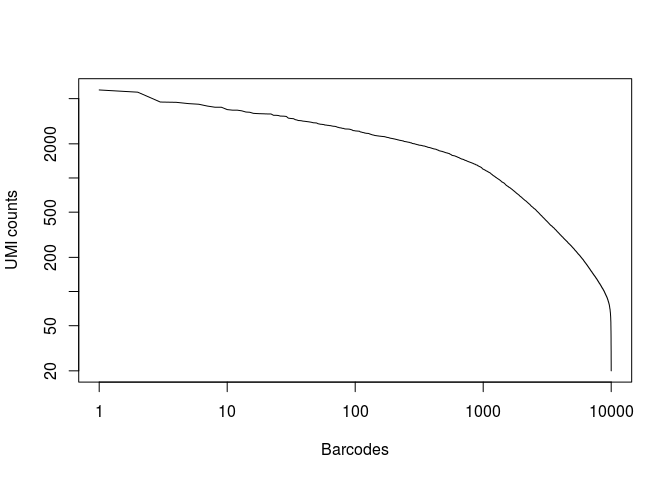

**Question**: What can you conclude from the above representation? How many of the top barcodes would you keep for further analysis?

<details><summary>Click Here to see the answer</summary>
<p>
There appears to be a drop in the total number of UMI counts after the first 1,000 barcodes. However, unlike what we saw in the 10x dataset, the separation between an empty GEM and a GEM containing a cell is less clear. This could be due to the presence of ambient RNA in the sample. 
</p><p>
In the original study, taking into account the full set of 91 samples, the authors selected a threshold of 500 UMI counts to select barcodes for further analysis. Thus we are left with 2684 cells for further analysis.
</p>

<pre> 
plot(x, log="xy",type="l", xlab="Barcodes", ylab="UMI counts")
abline(h=500, lty="dashed")
</pre>

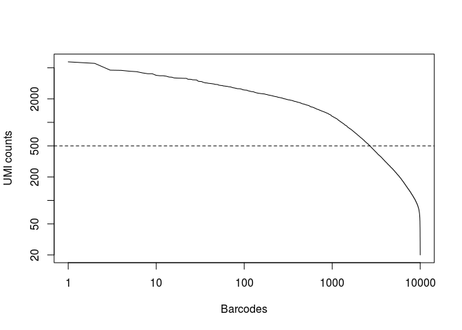


<pre> 
(num.barcodes <- length(which(x >= 500)))
</pre>


<pre> 
## [1] 2684
</pre>

</details>

---

We remove from the matrix all barcodes below the selected total UMI threshold.


```r
mat.raw <- mat.raw[ , which(colSums(mat.raw) >= 500) ]

dim(mat.raw)
```

```
## [1] 16566  2684
```

To use the `Seurat` package, we first need to create a *Seurat object*. This is a complex data structure that will conveniently hold all relevant information during the analysis, such as the raw count data, the normalized expressions, reduced dimensions, cluster assignments, etc...

When creating the *Seurat object* we can specify certain filtering criteria that will immediately be applied to the matrix. Here we specify that we only want to consider genes expressed in at least 5 cells. Aproximately 3,500 genes are discarded from the matrix.


```r
sobj <- CreateSeuratObject(raw.data=mat.raw, min.cells = 5)

dim(sobj@data)
```

```
## [1] 12989  2684
```

Next we inspect the distributions of total counts per cell, and number of genes detected per cell. As expected, the higher the number of total counts in a cell, the higher the number of genes that we are able to detect.


```r
VlnPlot(sobj, features.plot = c("nUMI", "nGene"), point.size.use = 0.2)
```

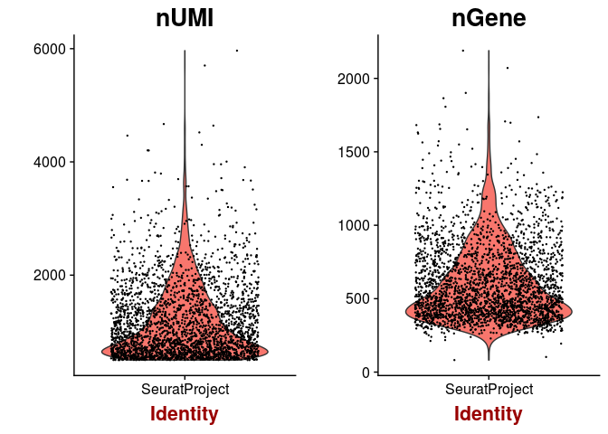

<br/>
<br/>

```r
plot(sobj@meta.data$nUMI, sobj@meta.data$nGene, pch=20, cex=0.5)
```


**Question**: Notice that the above plot seems to grow linearly. What does it suggest?

<details><summary>Click Here to see the answer</summary> 

This suggest that if the sample was sequenced deeper, we would be able to detect more genes.

</details>

---

Next we calculate the percentage of mitochondrial RNA in each cell and add this information as cell metadata. In *Mus musculus*, genes encoded in the mitochondria have names that start with "mt-" (e.g. mt-Atp6, mt-Nd1, ...). We then plot the distibutions of total UMI counts, number of detected genes and percent of mitochondrial RNA for all cells.


```r
mito.genes <- grep("^mt-", rownames(sobj@data), value = TRUE)
percent.mito <- Matrix::colSums(sobj@data[mito.genes, ]) / Matrix::colSums(sobj@data)
sobj <- AddMetaData(sobj, metadata = percent.mito, col.name = "percent.mito")

VlnPlot(sobj, features.plot = c("nUMI", "nGene", "percent.mito"))
```


<br/>

```r
plot(sobj@meta.data$nUMI, sobj@meta.data$percent.mito, pch=20, cex=0.5)
```

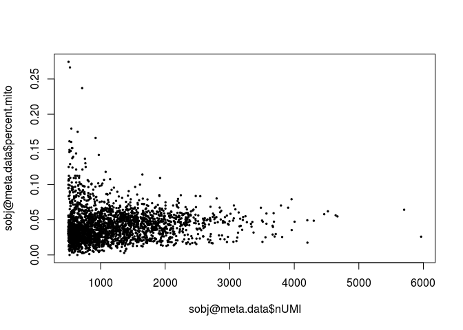

A few cells display higher than 10% abundance of mitochondrial RNA. These cells also appear to have lower UMI counts than average.

**Question:** What is a possible explanation for a high percentage of mitochondrial RNA in a scRNA-seq cell?

<details><summary>Click Here to see the answer</summary> 

A high percentage of mitochondrial RNA ususally indicates a dead or burst cell, as cytoplasmic RNA is lost while mitochondrial RNA remains protected.

</details>

---

**Question:** Examine the distrubutions above. What cells, if any, would you remove from the analysis?

<details><summary>Click Here to see the answer</summary> 

A high percentage of mitochondrial RNA can indicate defective cells, so we should probably remove those. Also, barcodes with a much higher than average number of detected genes may indicate a multiplet (multiple cells in the same droplet), so we also remove barcodes with more than 1500 genes detected. 

</details>

---


```r
sobj <- FilterCells(sobj, subset.names = "nGene", high.thresholds = 1500)
sobj <- FilterCells(sobj, subset.names = "percent.mito", high.thresholds = 0.1)

dim(sobj@data)
```

```
## [1] 12989  2611
```
<br/>

## Normalization

We need to normalize each cell for the total UMI counts for that cells. This normalization assumes that the total amount of RNA molecules in each cell is similar. We also log-transform the UMI counts and scale them to the median UMI counts across all cells.


```r
sobj <- NormalizeData(sobj, normalization.method = "LogNormalize", scale.factor = median(sobj@meta.data$nUMI))

sobj@data[1:10, 1:10]
```

```
## 10 x 10 sparse Matrix of class "dgCMatrix"
```

```
##    [[ suppressing 10 column names 'AACGCCGTCGGTCCTTTC', 'CCGCTAAACGCCTCGGGT', 'AGTCGTCCATCTGTATAC' ... ]]
```

```
##                                                                       
## 0610007P14Rik . .         .        0.2889806 .         . . .         .
## 0610009B22Rik . .         0.282853 .         .         . . .         .
## 0610009L18Rik . .         .        .         .         . . .         .
## 0610009O20Rik . .         0.282853 .         .         . . 0.2072077 .
## 0610010F05Rik . .         .        .         .         . . .         .
## 0610011F06Rik . .         .        .         0.3396339 . . .         .
## 0610012G03Rik . .         .        .         .         . . .         .
## 0610030E20Rik . .         .        .         .         . . .         .
## 0610037L13Rik . 0.2679462 .        .         .         . . 0.2072077 .
## 0610040B10Rik . .         .        .         .         . . .         .
##                        
## 0610007P14Rik .        
## 0610009B22Rik .        
## 0610009L18Rik .        
## 0610009O20Rik .        
## 0610010F05Rik .        
## 0610011F06Rik 0.5245681
## 0610012G03Rik .        
## 0610030E20Rik .        
## 0610037L13Rik .        
## 0610040B10Rik .
```
<br/>

## Finding highly variable genes

Housekeeping genes that are similarly expressed in all cell populations are not useful for the purpose of identifying these populations. Thus, it is often useful to select a subset of genes that display higher than average variability among cells to be used for dimensionality reduction and clustering of cells, as this will greatly speed-up the computations. 

The `FindVariableGenes` from the *Seurat* package does this by selecting genes that display a variance/mean ratio above a user-supplied threshold. Here we select genes that have a dispersion more than 0.5 standard deviations above the average dispersion of genes with a similar expression level (`y.cuttoff`). We can also set thresholds for minimum expression (`x.low.cutoff`) and maximum expression (`x.high.cutoff`).  


```r
sobj <- FindVariableGenes(sobj, mean.function = ExpMean, dispersion.function = LogVMR,  
                          x.low.cutoff = 0.025, x.high.cutoff = 3, y.cutoff = 0.5)
```

```
## Warning in KernSmooth::bkde2D(x, bandwidth = bandwidth, gridsize = nbin, :
## Binning grid too coarse for current (small) bandwidth: consider increasing
## 'gridsize'
```

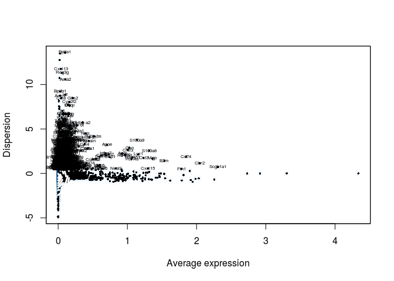

```r
length(sobj@var.genes)
```

```
## [1] 944
```

We can check the expression of a few of these variable genes across all cells using the `VlnPlot` function. We plot the expression of the 6 variable genes with highest dispersion, and the 6 variable genes with highest mean.


```r
hvginfo <- sobj@hvg.info[ sobj@var.genes, ]
highest.dispersion <- head(rownames(hvginfo)[ order(-hvginfo$gene.dispersion) ])
highest.mean <- head(rownames(hvginfo)[ order(-hvginfo$gene.mean) ])

VlnPlot(sobj, features.plot = highest.dispersion, point.size.use=0.2)
```

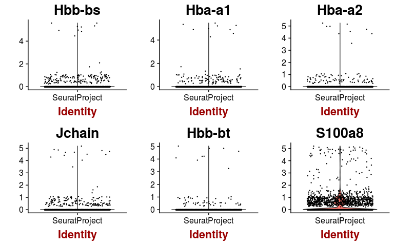

```r
VlnPlot(sobj, features.plot = highest.mean, point.size.use=0.2)
```


<br/>

## Dimensional reduction

In *Seurat*, principal component analysis is done on scaled expression data. The `ScaleData` function performs this step, and also allows to regress out common sources of technical variation, such as the total UMI counts per cell or the percentage of mitochondrial RNA.


```r
sobj <- ScaleData(object = sobj, vars.to.regress = c("nUMI", "percent.mito"))
```

```
## Regressing out: nUMI, percent.mito
```

```
## 
## Time Elapsed:  15.9327945709229 secs
```

```
## Scaling data matrix
```

Additionally, using the set of highly variable genes for dimensional reduction instead of the whole transcriptome helps to both speed-up the PCA computation and reduce the impact of low expressed (and noisy) genes.


```r
sobj <- RunPCA(object = sobj, pc.genes = sobj@var.genes, pcs.compute = 40, do.print=FALSE)

p1 <- PCAPlot(object = sobj, dim.1 = 1, dim.2 = 2, do.return=TRUE) + theme(legend.pos="none")
p2 <- PCAPlot(object = sobj, dim.1 = 2, dim.2 = 3, do.return=TRUE) + theme(legend.pos="none")
grid.arrange(p1, p2, ncol=2)
```

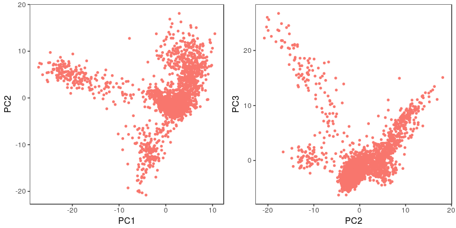

The next question is how many of the top principal components (PCs) are we going to use for the purpose of clustering the cells. The first thing to look at is the PCA scree-plot, showing the proportion of variance explained by each component. We are looking for a "knee" in the plot, where additional PCs do not bring much more new information.

For this purpose, *Seurat* provides the function `PCElbowPlot`, that displays the standard-deviation of each PC.


```r
PCElbowPlot(sobj, num.pc = 40)
```


We can also calculate the proportion of variance ourselves and plot it (the two representations are proportional to each other).


```r
eigs <- sobj@dr$pca@sdev**2
props <- eigs / sum(eigs)
plot(props, ylab="Proportion of variance", xlab="Principal Component")
```

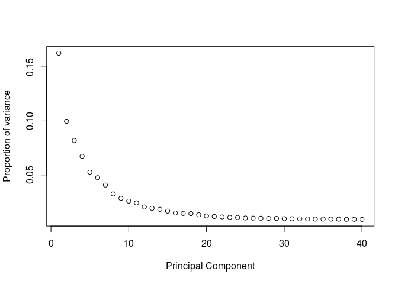

**Question**: Based on the above plots, how many principal components would you consider for further analysis.

<details><summary>Click Here to see the answer</summary>

There is a drop in the percentage of variance explained after PC15 and the plot seems to reach saturation after approximately 20 PCs. Thus, 15 to 20 PCs seem to be adequate for this dataset.

</details>

---

<br/>

## Clustering

Because of the high dimensionality of scRNA-seq datasets, clustering algorithms face a number of challenges, such as high computation times and memory requirements. To alieviate these problems, one solution is to perform the clustering using the cells PCA scores instead of the full expression matrix, where each principal component represents the signal of a correlated set of genes. Based on the analysis above, we are going to proceed using 20 PCs.

`Seurat` uses a graph based clustering algorithm. The `resolution` parameter influences the granularity of the clusters, with higher values producing more and smaller clusters. 


```r
sobj <- FindClusters(sobj, reduction.type = "pca", dims.use = 1:20, 
    resolution = 1.2, print.output = 0, save.SNN = FALSE)
```

The PCA plot will now display the identified clusters. 


```r
p1 <- PCAPlot(sobj, dim.1 = 1, dim.2 = 2, do.return=TRUE)
p2 <- PCAPlot(sobj, dim.1 = 2, dim.2 = 3, do.return=TRUE)
grid.arrange(p1, p2, ncol=2)
```

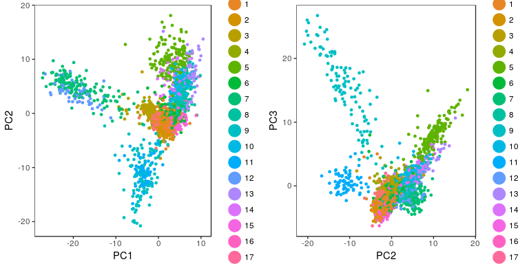

<br/>

## Visualizing clusters with a t-SNE plot

t-distributed stochastic neighbor embedding is a nonlinear dimensionality reduction often used in scRNA-seq analyses to visualize cell subpolulations. It is used to embed high dimensional scRNA-seq expressions in a 2D or 3D plot. Its main advantage compared to PCA is its ability to detect structures in the data that cannot be found by simple rotations (see [t-SNE: What the hell is it?](https://constantamateur.github.io/2018-01-02-tSNE/)).

Although useful to visualize single cell data, care should be taken when interpreting its results:

- t-SNE is an iterative stochastic algorithm. This means that it will produce different results each time it is run. 
- Because t-SNE *does not preserve distances*, one should not over-interpret the higher order structures of the plot. i.e. just because two clusters appear close toghether on the plot, does not mean they are similar. 
- The t-SNE algorithm is sensitive to the choice of its *perplexity* parameter. This parameter determines what the algorithm considers to be neighboring points. i.e. the number of neighbors of each point is roughly equal to the specified perplexity.

Read more about t-SNE:

- [t-distributed stochastic neighbor embedding (Wikipedia)](https://en.wikipedia.org/wiki/T-distributed_stochastic_neighbor_embedding)
- [How to Use t-SNE Effectively](https://distill.pub/2016/misread-tsne/)

For scRNA-seq datasets, a `perplexity` value in the range of 20 to 50 usually produces good results.


```r
sobj <- RunTSNE(sobj, dims.use = 1:20, do.fast = TRUE, perplexity=30)
TSNEPlot(sobj, do.label = TRUE)
```


**Exercise**: Modify the commands above to try different values of the `perplexity` argument. E.g. 5, 10, 20, 50, ...

<details><summary>Click Here to see the solution</summary>


<pre>
tmp <- RunTSNE(sobj, dims.use = 1:20, do.fast = TRUE, perplexity=5)
TSNEPlot(tmp, do.label = TRUE)
</pre>

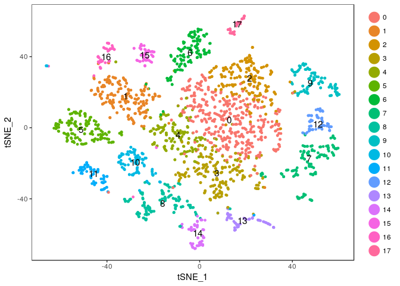


<pre>
tmp <- RunTSNE(sobj, dims.use = 1:20, do.fast = TRUE, perplexity=10)
TSNEPlot(tmp, do.label = TRUE)
</pre>

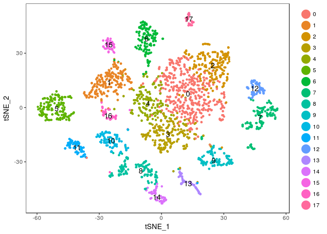


<pre>
tmp <- RunTSNE(sobj, dims.use = 1:20, do.fast = TRUE, perplexity=20)
TSNEPlot(tmp, do.label = TRUE)
</pre>

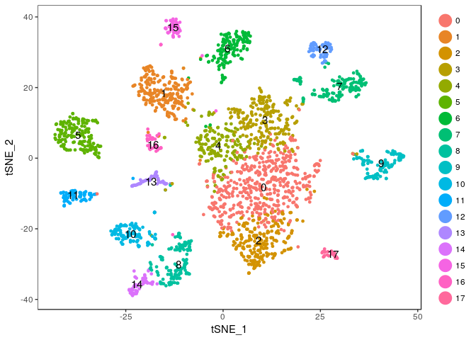


<pre>
tmp <- RunTSNE(sobj, dims.use = 1:20, do.fast = TRUE, perplexity=50)
TSNEPlot(tmp, do.label = TRUE)
</pre>


</details>

<br/>

## Finding marker genes

Seurat implements several methods for the discovery of cluster marker genes (differential expression). By default it uses two sample Wilcoxon tests, which for large datasets scRNA-seq with many cells has been shown to perform well. To speed up the computation, we will not test all genes, but only those that are destected in at least 25% of the cells in either population (the tested cluster or the combination of all other clusters) and have at least 0.25 log fold-change difference between the two populations.


```r
markers <- FindAllMarkers(object = sobj, only.pos = TRUE, min.pct = 0.25, thresh.use = 0.25)
markers <- markers[ markers$p_val_adj < 0.01, ]

write.table(markers, file="lung1_markers.txt")
```

The above command will return a table containing all identied markers (differentially expressed genes) for each cluster. For example, the *Sftpa1* gene is identified as a marker gene for cluster 0. It is expressed in 100% of the cells in cluster 0, and 82.8% of cells in other clusters. However, it is 2-fold up-regulated in cells belonging to cluster 0.


```r
head(markers)
```

```
##                p_val avg_logFC pct.1 pct.2     p_val_adj cluster   gene
## Sftpa1 8.384552e-146 1.0754143 1.000 0.828 1.089069e-141       0 Sftpa1
## Sftpc  4.872784e-139 0.9457523 1.000 1.000 6.329259e-135       0  Sftpc
## Sftpd  2.696345e-129 0.8275701 0.992 0.565 3.502282e-125       0  Sftpd
## Cxcl15 1.373255e-124 0.8062110 0.968 0.415 1.783721e-120       0 Cxcl15
## Cbr2   1.063595e-122 0.8765345 0.994 0.704 1.381504e-118       0   Cbr2
## Sftpb  3.691881e-121 0.9215731 0.998 0.697 4.795385e-117       0  Sftpb
```

Seurat provides several functions to visualize the expression of these genes. We visualize the top markers for all clusters as a single heatmap. 


```r
top.markers <- do.call(rbind, lapply(split(markers, markers$cluster), head))
DoHeatmap(sobj, genes.use = top.markers$gene, slim.col.label = TRUE, remove.key = TRUE)
```

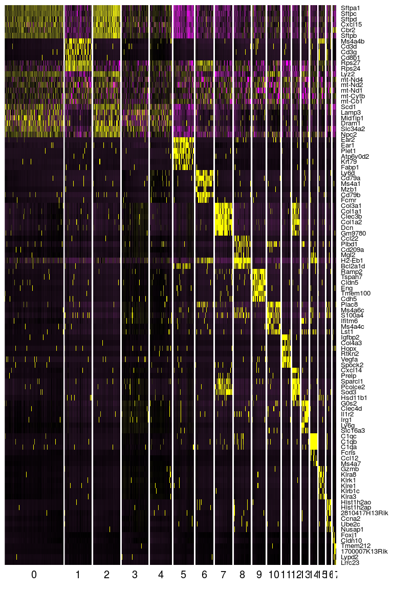

Or we can investigate the expression of specific genes. Below we plot the expression of the top 6 markers for cluster 0 as violin plots, and by projecting the expression of these genes on a t-SNE plot.


```r
markers.0 <- markers[ which(markers$cluster == 0), ]

VlnPlot(sobj, features.plot = head(markers.0$gene), point.size.use=0.5)
```

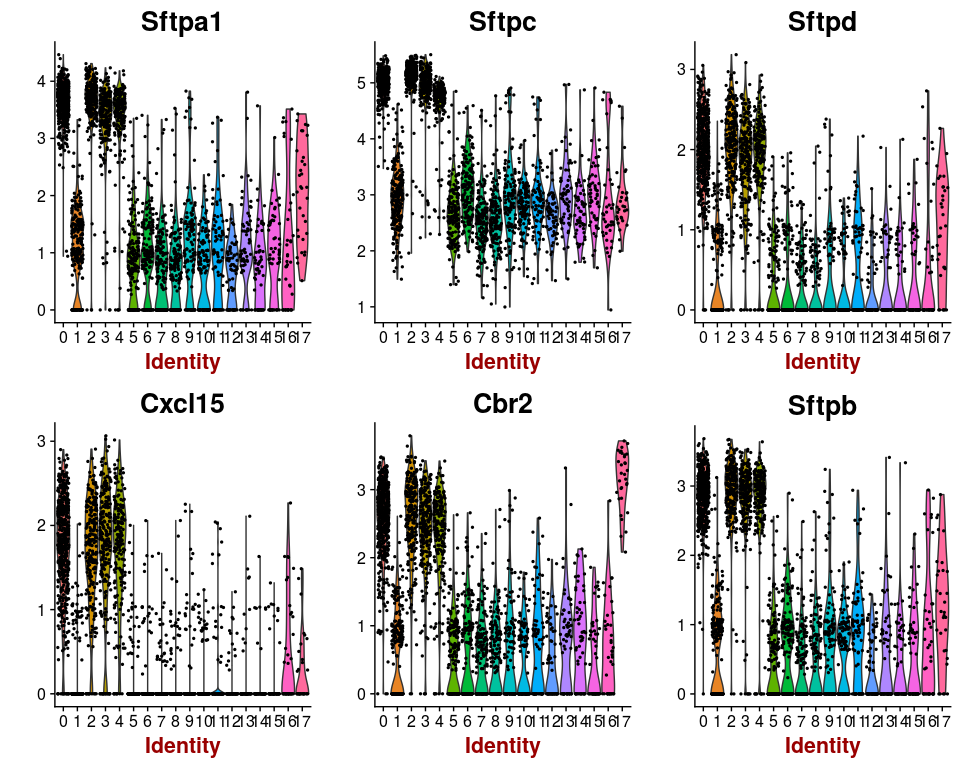

```r
FeaturePlot(sobj, features.plot = head(markers.0$gene), cols.use = c("grey", "blue"), reduction.use = "tsne")
```


**Exercise**: Modify the commands above to plot the top markers of cluster 7.

<details><summary>Click Here to see the solution</summary>


<pre>
markers.7 <- markers[ which(markers$cluster == 7), ]
FeaturePlot(sobj, features.plot = head(markers.7$gene), cols.use = c("grey", "blue"), reduction.use = "tsne")
</pre>

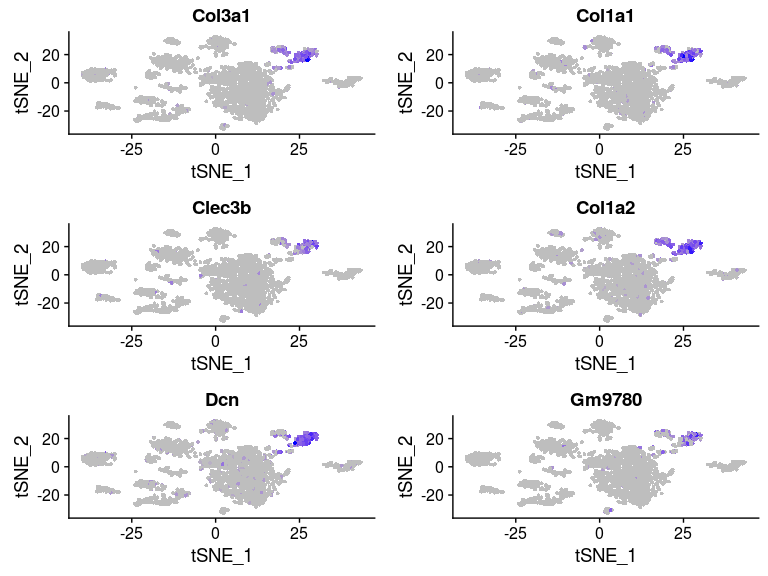

<pre>
VlnPlot(sobj, features.plot = head(markers.7$gene), point.size.use=0.5)
</pre>

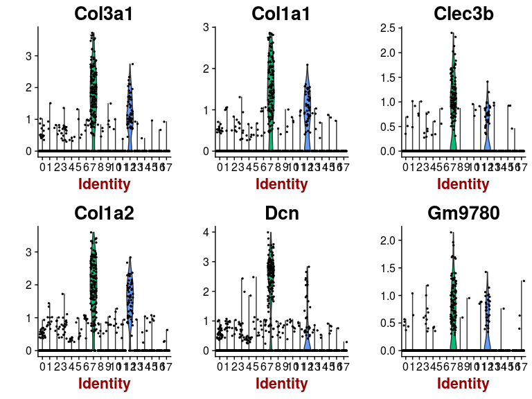

</details>

---

**Question**: What can you conclude from the above plots?

<details><summary>Click Here to see the solution</summary>

Some of the clusters appear to be very similar to each other. In particular, clusters 0, 2, 3 and 4 appear to be very similar. This is the result of <em>over-clustering</em> the cells, which splits large clusters of similar cells into smaller clusters based on small, negligeable, differences between the cells.

</details>

---

**Question**: Based on the t-SNE visualization, and expression of marker genes represented in the above plots, do you think any of the clusters should be combined? If yes, which ones?

<details><summary>Click Here to see the answer</summary>
It appears from the expression heatmap that clusters 0, 2, 3 and 4 represent the same population of cells. Clusters 7 and 12 also appear to be very similar, although they are clearly separated on the t-SNE. 
</details>

---

We can check for differences between two specific clusters. Below we check if there any genes that distiguish clusters 0 and 2. It appears that these clusters are distiguished only by a small difference in the expression of 6 mitochondrion encoded genes. 


```r
markers.0.2 <- FindMarkers(sobj, ident.1 = 0, ident.2 = 2, min.pct=0.25)
markers.0.2 <- markers.0.2[ markers.0.2$p_val_adj < 0.01, ]

markers.0.2
```

```
##                p_val avg_logFC pct.1 pct.2    p_val_adj
## mt-Co1  1.155037e-21 0.3012052 1.000 0.952 1.500277e-17
## mt-Nd1  2.354213e-21 0.2840574 1.000 0.974 3.057887e-17
## mt-Cytb 8.921074e-21 0.2660421 1.000 0.991 1.158758e-16
## mt-Nd4  2.576016e-15 0.2560986 1.000 0.983 3.345987e-11
## mt-Nd2  2.824157e-14 0.2512868 1.000 0.969 3.668298e-10
## mt-Co3  1.370586e-11 0.2622473 0.956 0.834 1.780254e-07
```

**Exercise**: Modify the commands above to check for diferences between clusters 0 and 3, 0 and 4. Also compare clusters and 7 and 12.

<details><summary>Click Here to see the solution</summary>


<pre>
markers.0.3 <- FindMarkers(sobj, ident.1 = 0, ident.2 = 3, min.pct=0.25)
(markers.0.3 <- markers.0.3[ markers.0.3$p_val_adj < 0.01, ])
</pre>


<pre>
##                p_val  avg_logFC pct.1 pct.2    p_val_adj
## mt-Nd4  9.841152e-31 -0.3435626 1.000 0.996 1.278267e-26
## mt-Nd1  2.357704e-30 -0.3334831 1.000 1.000 3.062422e-26
## mt-Cytb 1.696221e-29 -0.2857224 1.000 1.000 2.203221e-25
## mt-Co1  5.949068e-29 -0.2972600 1.000 1.000 7.727245e-25
## mt-Nd2  4.383851e-27 -0.3321984 1.000 1.000 5.694184e-23
## mt-Co3  2.476056e-19 -0.3242902 0.956 0.974 3.216149e-15
## Cd74    3.516725e-09  0.2524194 0.954 0.833 4.567874e-05
</pre>

<pre>
markers.0.4 <- FindMarkers(sobj, ident.1 = 0, ident.2 = 4, min.pct=0.25)
(markers.0.4 <- markers.0.4[ markers.0.4$p_val_adj < 0.01, ])
</pre>

<pre>
##              p_val  avg_logFC pct.1 pct.2    p_val_adj
## Sftpc 7.733270e-48  0.2882008 1.000 1.000 1.004474e-43
## B2m   6.303101e-10 -0.2691494 0.612 0.868 8.187098e-06
</pre>

<pre>
markers.7.12 <- FindMarkers(sobj, ident.1 = 7, ident.2 = 12, min.pct=0.25)
(markers.7.12 <- markers.7.12[ markers.7.12$p_val_adj < 0.01, ])
</pre>

<pre>
##                 p_val  avg_logFC pct.1 pct.2    p_val_adj
## Cxcl14   3.834629e-31 -1.2513125 0.073 0.851 4.980799e-27
## Npnt     3.995809e-30 -0.9071321 0.053 0.791 5.190156e-26
## Inmt     4.162204e-23 -1.3371193 0.656 1.000 5.406286e-19
## Hsd11b1  6.917673e-22 -0.8515735 0.093 0.716 8.985366e-18
## Gpx3     6.922612e-21 -1.1869715 0.424 0.925 8.991781e-17
## Sept4    6.589080e-20 -0.7216886 0.093 0.672 8.558556e-16
## Dcn      4.731405e-18  1.5361208 0.887 0.433 6.145623e-14
## Aldh1a1  5.985015e-18 -0.6110383 0.086 0.612 7.773936e-14
## Limch1   1.610576e-15 -0.5270906 0.099 0.597 2.091977e-11
## Serpinf1 3.106935e-14  0.8852001 0.642 0.090 4.035598e-10
## Prelp    3.069915e-13 -0.5757953 0.132 0.582 3.987512e-09
## Tmem176a 4.252569e-13 -0.5666180 0.285 0.761 5.523662e-09
## Itga8    1.457160e-12 -0.3735441 0.026 0.388 1.892705e-08
## Pi16     1.739423e-12  0.7470882 0.556 0.030 2.259336e-08
## Sparcl1  1.843517e-12 -0.6516152 0.603 0.940 2.394544e-08
## Gyg      1.119171e-11 -0.3837300 0.066 0.448 1.453691e-07
## Sod3     3.880114e-11 -0.6505828 0.682 0.910 5.039880e-07
## Tmem176b 5.123389e-11 -0.5823912 0.417 0.791 6.654770e-07
## Igfbp4   5.378103e-11  0.8464085 0.742 0.313 6.985618e-07
## Cdo1     6.647703e-11 -0.3124234 0.020 0.328 8.634702e-07
## Fmo2     7.736882e-11 -0.5289315 0.318 0.761 1.004944e-06
## Ly6a     1.292407e-10  0.7690845 0.596 0.134 1.678707e-06
## Tbx2     1.875072e-10 -0.2794454 0.040 0.358 2.435531e-06
## Mettl7a1 1.878926e-10 -0.5857133 0.166 0.567 2.440537e-06
## Cd82     2.746306e-10 -0.3410403 0.099 0.478 3.567177e-06
## Fhl1     5.138078e-10 -0.6017082 0.377 0.776 6.673849e-06
## Gsta3    7.559029e-10 -0.3332190 0.060 0.388 9.818423e-06
## Pcolce2  7.932435e-10 -0.6664483 0.570 0.896 1.030344e-05
## Cst3     8.274442e-10 -0.5127938 0.887 1.000 1.074767e-05
## Ppp1r14a 1.426405e-09 -0.3846336 0.079 0.418 1.852758e-05
## Lrat     5.230371e-09 -0.3790732 0.046 0.328 6.793729e-05
## Meg3     5.315955e-09  0.5134390 0.444 0.045 6.904893e-05
## Hspb1    1.599081e-08 -0.4277408 0.272 0.687 2.077047e-04
## Spon1    1.851763e-08 -0.3764746 0.086 0.388 2.405255e-04
## Selenbp1 2.495785e-08 -0.5091736 0.278 0.597 3.241775e-04
## Lum      2.791038e-08  0.4560768 0.358 0.000 3.625280e-04
## Ces1d    5.774381e-08 -0.3983095 0.053 0.313 7.500343e-04
## Adh1     1.130875e-07 -0.4796724 0.510 0.791 1.468893e-03
## Crip1    1.619444e-07  0.6992307 0.775 0.433 2.103495e-03
## Col3a1   2.941686e-07  0.8273431 0.907 0.806 3.820956e-03
## Mgp      4.152785e-07 -0.4240046 0.960 1.000 5.394053e-03
## Col14a1  4.228662e-07  0.3345514 0.503 0.119 5.492610e-03
</pre>

<pre>
FeaturePlot(sobj, features.plot = c("Dcn", "Cxcl14"), cols.use = c("grey", "blue"), reduction.use = "tsne")
</pre>

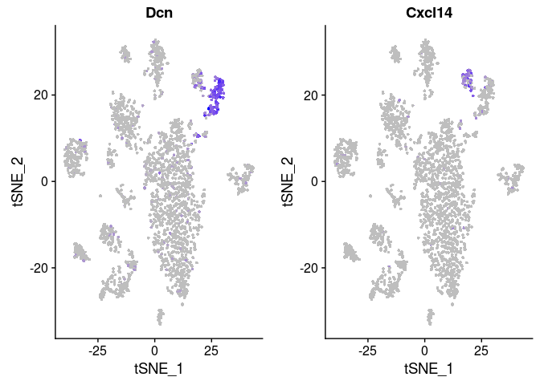

It appears that most differences between clusters 0, 2, 3 and 4 are due to small differences in the amount of mitochondrial RNA. Clusters 7 and 12 however display a larger amount of differentially expressed genes, and might indeed represent different cell populations.

</details>

---

We will merge clusters 0, 2, 3 and 4 into a single cluster (that we name 18). But first, we save the old cluster ids so we can restore them later if need arises.


```r
sobj <- StashIdent(sobj, save.name = "OriginalClusterNames")

current.cluster.ids <- c(0,1,2,3,4,5,6,7,8,9,10,11,12,13,14,15,16,17)
new.cluster.ids <- c(18,1,18,18,18,5,6,7,8,9,10,11,12,13,14,15,16,17)
sobj@ident <- plyr::mapvalues(sobj@ident, from = current.cluster.ids, to = new.cluster.ids)
```

And plot the t-SNE again to check the result.


```r
TSNEPlot(sobj, do.label = TRUE)
```


Finally, we run the `FindAllMarkers` function again to account for the new clustering.


```r
markers <- FindAllMarkers(object = sobj, only.pos = TRUE, min.pct = 0.25, thresh.use = 0.25)
markers <- markers[ markers$p_val_adj < 0.01, ]

write.table(markers, file="lung1_markers_fixed.txt", quote = FALSE)
```


```r
top.markers <- do.call(rbind, lapply(split(markers, markers$cluster), head))
DoHeatmap(sobj, genes.use = top.markers$gene, slim.col.label = TRUE, remove.key = TRUE)
```


<br/>

## Annotation of cell clusters

Now that we have a clear set of 15 clusters and marker genes associated with each cluster, we may start annotating these clusters, by trying to identify what cell types are associated with each cluster. 

Some cells have well known markers. For example, the gene Ms4a1 is a marker for B-cells, while Il7r and Cd8a are expressed in T-cells. By inspecting the expression of these genes, B-cell and T-cell clusters can be easily identified.


```r
FeaturePlot(sobj, features.plot = c("Il7r", "Cd8a", "Ms4a1"), cols.use=c("grey", "red"), pt.size=0.5)
```

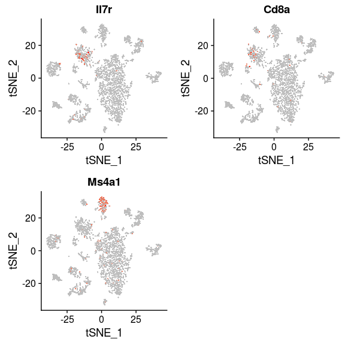


```r
VlnPlot(sobj, features.plot = c("Il7r", "Cd8a", "Ms4a1"), point.size.use=0.2)
```

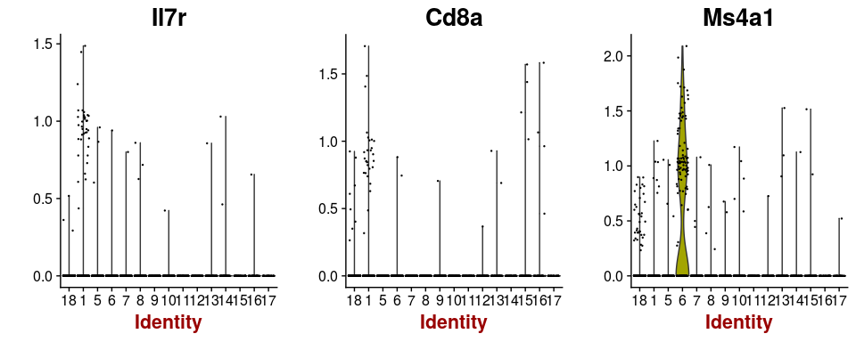

Through the inspection of the top markers identified in each cluster one may begin manually annotating remaining clusters. Tomorrow, we will see how functional analysis can also help in the process of identifying cell types using the full set of marker genes in each cluster.

For now, we will import the annotated cell assignments from the published study and store them as metadata in the *Seurat* object. Then we plot our t-SNE projection highlighting the cell assignments from the paper and see how well can our clustering assignment recapitulate their results.  


```r
annotation <- read.table("reference/MCA_CellAssignments.csv", header=TRUE, sep=",")

sobj@meta.data$Cell.name <- paste0("Lung_1.", rownames(sobj@meta.data))

sobj@meta.data$Annotation <- annotation$Annotation[ match(sobj@meta.data$Cell.name, annotation$Cell.name) ]
sobj@meta.data$Annotation <- gsub("\\(Lung\\)", "", sobj@meta.data$Annotation)

TSNEPlot(sobj, group.by="Annotation", do.label=TRUE, do.return=TRUE) + theme(legend.position = "none") 
```

```
## Warning: Removed 1 rows containing missing values (geom_text).
```

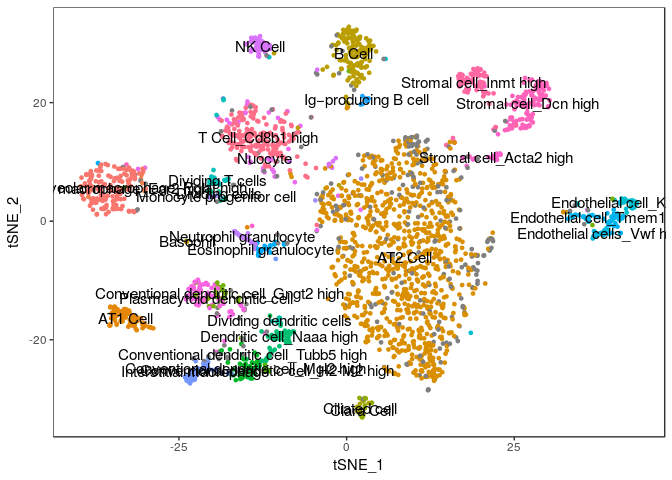

We can compare our clustering result with the annotated cells by tabulating cluster cell assignments. 


```r
cluster.comparison <- table(sobj@ident, sobj@meta.data$Annotation)
mdf <- melt(cluster.comparison, varnames = c("Cluster", "Annotation"), value.name = "Cells")

ggplot(mdf, aes(x=factor(Cluster), y=Annotation)) + 
  geom_text(aes(label=Cells, alpha=Cells>0))
```


Some of the clusters defined in the study are sub-populations of the same type of cells, differing only in the expression of a few genes. Below, we simplify these cluster assignments.


```r
sobj@meta.data$AnnotationSimple <- gsub("_.*", "", sobj@meta.data$Annotation)

TSNEPlot(sobj, group.by="AnnotationSimple", do.label=TRUE, do.return=TRUE) + theme(legend.position = "none")
```

```
## Warning: Removed 1 rows containing missing values (geom_text).
```


We can compare our clustering result with the annotated cells by tabulating cluster cell assignments. 


```r
cluster.comparison <- table(sobj@ident, sobj@meta.data$AnnotationSimple)
mdf <- melt(cluster.comparison, varnames = c("Cluster", "Annotation"), value.name = "Cells")

ggplot(mdf, aes(x=factor(Cluster), y=Annotation)) + 
  geom_text(aes(label=Cells, alpha=Cells>0))
```


We can also reproduce figure 4D.


```r
genes <- c("Sftpc", "Vwf", "Dcn", "Cxcl14")
FeaturePlot(sobj, features.plot = genes, cols.use=c("grey", "red"), no.legend = FALSE)
```

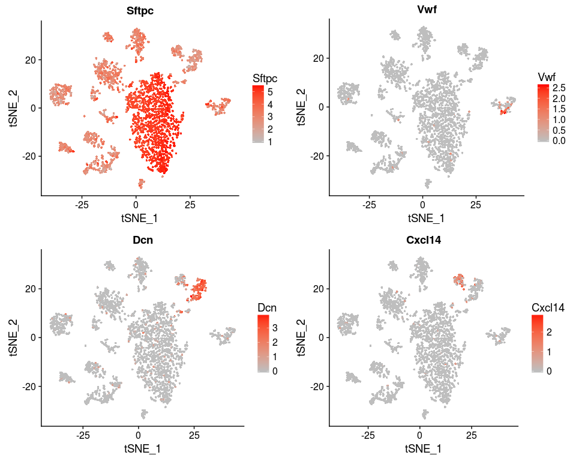

<br/>

## Session Information


```r
sessionInfo()
```

```
## R version 3.4.4 (2018-03-15)
## Platform: x86_64-pc-linux-gnu (64-bit)
## Running under: Ubuntu 16.04.4 LTS
## 
## Matrix products: default
## BLAS: /usr/lib/libblas/libblas.so.3.6.0
## LAPACK: /usr/lib/lapack/liblapack.so.3.6.0
## 
## locale:
##  [1] LC_CTYPE=pt_PT.UTF-8       LC_NUMERIC=C              
##  [3] LC_TIME=pt_PT.UTF-8        LC_COLLATE=en_US.UTF-8    
##  [5] LC_MONETARY=pt_PT.UTF-8    LC_MESSAGES=en_US.UTF-8   
##  [7] LC_PAPER=pt_PT.UTF-8       LC_NAME=C                 
##  [9] LC_ADDRESS=C               LC_TELEPHONE=C            
## [11] LC_MEASUREMENT=pt_PT.UTF-8 LC_IDENTIFICATION=C       
## 
## attached base packages:
## [1] stats     graphics  grDevices utils     datasets  methods   base     
## 
## other attached packages:
## [1] bindrcpp_0.2.2 reshape2_1.4.3 gridExtra_2.3  Seurat_2.3.3  
## [5] Matrix_1.2-14  cowplot_0.9.2  ggplot2_2.2.1 
## 
## loaded via a namespace (and not attached):
##   [1] tsne_0.1-3           segmented_0.5-3.0    nlme_3.1-137        
##   [4] bitops_1.0-6         bit64_0.9-7          RColorBrewer_1.1-2  
##   [7] rprojroot_1.3-2      prabclus_2.2-6       tools_3.4.4         
##  [10] backports_1.1.2      irlba_2.3.2          R6_2.2.2            
##  [13] rpart_4.1-13         KernSmooth_2.23-15   Hmisc_4.1-1         
##  [16] lazyeval_0.2.1       colorspace_1.3-2     trimcluster_0.1-2   
##  [19] nnet_7.3-12          tidyselect_0.2.4     diffusionMap_1.1-0  
##  [22] bit_1.1-12           compiler_3.4.4       htmlTable_1.11.1    
##  [25] hdf5r_1.0.0          labeling_0.3         diptest_0.75-7      
##  [28] caTools_1.17.1       scales_1.0.0         checkmate_1.8.5     
##  [31] lmtest_0.9-35        DEoptimR_1.0-8       mvtnorm_1.0-6       
##  [34] robustbase_0.92-8    ggridges_0.5.0       pbapply_1.3-4       
##  [37] dtw_1.18-1           proxy_0.4-21         stringr_1.3.1       
##  [40] digest_0.6.16        mixtools_1.1.0       foreign_0.8-70      
##  [43] rmarkdown_1.9        R.utils_2.6.0        base64enc_0.1-3     
##  [46] pkgconfig_2.0.2      htmltools_0.3.6      htmlwidgets_1.2     
##  [49] rlang_0.2.2          rstudioapi_0.7       bindr_0.1.1         
##  [52] jsonlite_1.5         zoo_1.8-1            ica_1.0-1           
##  [55] mclust_5.4           gtools_3.5.0         acepack_1.4.1       
##  [58] dplyr_0.7.6          R.oo_1.21.0          magrittr_1.5        
##  [61] modeltools_0.2-21    Formula_1.2-2        lars_1.2            
##  [64] Rcpp_0.12.18         munsell_0.5.0        reticulate_1.5      
##  [67] ape_5.1              R.methodsS3_1.7.1    scatterplot3d_0.3-40
##  [70] stringi_1.2.4        yaml_2.2.0           MASS_7.3-50         
##  [73] flexmix_2.3-13       gplots_3.0.1         Rtsne_0.13          
##  [76] plyr_1.8.4           grid_3.4.4           parallel_3.4.4      
##  [79] gdata_2.18.0         crayon_1.3.4         doSNOW_1.0.16       
##  [82] lattice_0.20-35      splines_3.4.4        SDMTools_1.1-221    
##  [85] knitr_1.20           pillar_1.3.0         igraph_1.2.1        
##  [88] fpc_2.1-10           codetools_0.2-15     stats4_3.4.4        
##  [91] glue_1.3.0           evaluate_0.10.1      metap_0.9           
##  [94] latticeExtra_0.6-28  data.table_1.11.4    png_0.1-7           
##  [97] foreach_1.4.4        tidyr_0.8.1          gtable_0.2.0        
## [100] RANN_2.5.1           purrr_0.2.5          kernlab_0.9-25      
## [103] assertthat_0.2.0     class_7.3-14         survival_2.42-3     
## [106] tibble_1.4.2         snow_0.4-2           iterators_1.0.9     
## [109] cluster_2.0.6        fitdistrplus_1.0-9   ROCR_1.0-7
```

## References

- [https://satijalab.org/seurat/pbmc3k_tutorial.html](https://satijalab.org/seurat/pbmc3k_tutorial.html)
- [https://f1000research.com/articles/5-2122/v1](https://satijalab.org/seurat/pbmc3k_tutorial.html)

<br/>


### Back

Back to [previous page](L09.md#seurat-mca).
