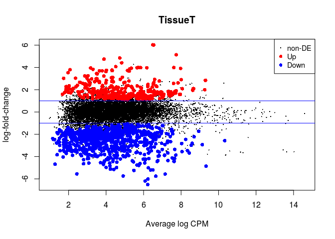

## Suggested solution - Introduction to edgeR GLMs

Here we demonstrate the use of *edgeR* to perform a differential expression analysis using data from Tuch *et al.* ([PLOS](http://journals.plos.org/plosone/article?id=10.1371/journal.pone.0009317)) as detailed in the edgeR manual.

The data is a set of RNA-seq samples of oral squamous cell carcinomas and matched normal tissue from three patients that were previously quantified into raw counts. 

We will use *edgeR* to do a differential expression analysis of Tumor vs Non-Tumor samples. We will start with a simple pairwise comparison of the Tumor and Non-Tumor samples, and then repeat the analysis adding the patient pairing information to the model design.

<br/>

## Load the count data

We start by importing the counts table into R using the `read.delim` function. Other functions to import tables include `read.table`  and `read.csv`. We also specify that the values in the tables are separated by a TAB. You can type `?read.delim` in the R console to display the documentation of the function.


```r
rawdata <- read.delim("edgeR_example1_Tuch.tab", sep = "\t")
```

To check that the data was loaded properly we can use functions such as `head` (to displays the first lines of the table), `dim` (to display the dimensions of the table) and `summary` (to display summary statistics for each column). In RStudio you can also type `View(rawdata)` to view the full table on a separate window.


```r
head(rawdata)
```

```
##       idRefSeq   N8 T8   N33 T33   N51  T51
## 1    NM_182502 2592  3  7805 321  3372    9
## 2    NM_003280 1684  0  1787   7  4894  559
## 3    NM_152381 9915 15 10396  48 23309 7181
## 4    NM_022438 2496  2  3585 239  1596    7
## 5 NM_001100112 4389  7  7944  16  9262 1818
## 6    NM_017534 4402  7  7943  16  9244 1815
```

```r
dim(rawdata)
```

```
## [1] 15668     7
```

```r
summary(rawdata)
```

```
##       idRefSeq           N8                 T8                N33        
##  NM_000014:    1   Min.   :     2.0   Min.   :     0.0   Min.   :     1  
##  NM_000016:    1   1st Qu.:   119.0   1st Qu.:    88.0   1st Qu.:   143  
##  NM_000017:    1   Median :   256.0   Median :   219.0   Median :   291  
##  NM_000018:    1   Mean   :   771.6   Mean   :   646.2   Mean   :  1270  
##  NM_000019:    1   3rd Qu.:   562.0   3rd Qu.:   503.0   3rd Qu.:   622  
##  NM_000020:    1   Max.   :393801.0   Max.   :330105.0   Max.   :581364  
##  (Other)  :15662                                                         
##       T33              N51               T51        
##  Min.   :     0   Min.   :      5   Min.   :     0  
##  1st Qu.:   171   1st Qu.:    317   1st Qu.:   223  
##  Median :   379   Median :    679   Median :   494  
##  Mean   :  1186   Mean   :   2162   Mean   :  1394  
##  3rd Qu.:   828   3rd Qu.:   1479   3rd Qu.:  1100  
##  Max.   :365430   Max.   :1675945   Max.   :633871  
## 
```

For convenience, we separate the table in two: one containing the counts for all samples (columns 2 to 7), and another containing only the list of gene names (column 1).


```r
rawcounts <- rawdata[, 2:7]
genes <- rawdata[, 1]
```
<br/>

## Simple pairwise differential expression analysis with edgeR GLMs

We need to import edgeR into the R environment.


```r
library(edgeR)
```

```
## Loading required package: limma
```

We start by telling edgeR where our raw counts are, and calculate normalization factors.


```r
y <- DGEList(counts=rawcounts, genes=genes)
y <- calcNormFactors(y)

y$samples
```

```
##     group lib.size norm.factors
## N8      1 12090121    1.0746801
## T8      1 10123913    1.1050377
## N33     1 19890767    0.7446805
## T33     1 18590376    1.0271063
## N51     1 33878462    0.9385600
## T51     1 21832978    1.1729954
```

After normalization, we can now produce a Multidimensional Scaling Plot (MDS) using the function `plotMDS`. This visualization, a type of dimensional reduction technique, places the samples on a plane such that the distance between samples approximates the typical log2 fold-changes between them.


```r
plotMDS(y)
```


We now define the design of our comparison. We want to compare Tumor to Non-Tumor samples. So we first create a variable indicating which samples are from normal (N) or tumor (T) tissue. Then we define the design for the genewise linear models. Here, the `~ Tissue` design is equivalent to a simple pairwise test of Tumor vs Non-tumor (i.e. the model only takes into account the originating tissue).


```r
Tissue <- factor(c("N","T","N","T","N","T"))

design <- model.matrix(~ Tissue)
rownames(design) <- colnames(y)

design
```

```
##     (Intercept) TissueT
## N8            1       0
## T8            1       1
## N33           1       0
## T33           1       1
## N51           1       0
## T51           1       1
## attr(,"assign")
## [1] 0 1
## attr(,"contrasts")
## attr(,"contrasts")$Tissue
## [1] "contr.treatment"
```

Next we use this design to conduct the test of differential expression. In *edgeR*, this is done in 3 steps: estimation of the negative binomial dispersions (`estimateDisp`), fitting of the negative binomial model to the count data (`glmFit`) and hypothesis testing (`glmLRT`).


```r
y <- estimateDisp(y, design, robust=TRUE)
fit <- glmFit(y, design)
lrt <- glmLRT(fit)
```

We now check how many genes were differentially expressed.


```r
summary(decideTestsDGE(lrt))
```

```
##        TissueT
## Down       956
## NotSig   14335
## Up         377
```

In *edgeR* we make an MA-plot with the `plotMD` function. Up-regulated genes are indicated in red, and down-regulated genes are indicated in blue. The horizontal lines indicate 2x fold-changes.


```r
plotMD(lrt)
abline(h=c(-1, 1), col="blue")
```



We can retrieve a table with all the results of differential expression using the `topTags` function. We also save it to a file so we can latter open it in Excel.


```r
result <- as.data.frame(topTags(lrt, n = nrow(rawcounts)))

head(result)
```

```
##           genes     logFC   logCPM       LR       PValue          FDR
## 15660 NM_198964  3.969929 5.653315 70.20133 5.355024e-17 8.390251e-13
## 102   NM_004320 -4.472638 5.464585 66.53939 3.429713e-16 2.176337e-12
## 103   NM_173201 -4.462351 5.454729 66.15553 4.167099e-16 2.176337e-12
## 200   NM_031469 -4.022319 5.038015 64.88296 7.948160e-16 3.033213e-12
## 53    NM_005609 -5.241483 5.485800 64.49462 9.679643e-16 3.033213e-12
## 15654 NM_198966  3.872656 5.256142 63.37970 1.704659e-15 4.451432e-12
```

```r
write.table(result, file = "edgeR_Tuch_Tumor_vs_NonTumor.csv", sep="\t", row.names = FALSE)
```
<br/>


## A more complex design: adding patient pairing information

Recall that tumor and non-samples were collected from 3 patients. Until now we have ignored this information in our design. Here we repeat the analysis by adding the sample pairing information to our model design, that will allow us to adjust for differences between patients.

For this we only have to change the design definition. We create a new `Patient` variable, and then include it as a blocking factor in the GLM design. 


```r
Patient <- factor(c(8, 8, 33, 33, 51, 51))
Tissue <- factor(c("N","T","N","T","N","T"))

design <- model.matrix(~ Patient + Tissue)
rownames(design) <- colnames(y)

design
```

```
##     (Intercept) Patient33 Patient51 TissueT
## N8            1         0         0       0
## T8            1         0         0       1
## N33           1         1         0       0
## T33           1         1         0       1
## N51           1         0         1       0
## T51           1         0         1       1
## attr(,"assign")
## [1] 0 1 1 2
## attr(,"contrasts")
## attr(,"contrasts")$Patient
## [1] "contr.treatment"
## 
## attr(,"contrasts")$Tissue
## [1] "contr.treatment"
```

```r
y <- DGEList(counts=rawcounts, genes=genes)
y <- calcNormFactors(y)
y <- estimateDisp(y, design, robust=TRUE)
fit <- glmFit(y, design)
lrt <- glmLRT(fit)

de <- decideTestsDGE(lrt)
summary(de)
```

```
##        TissueT
## Down      1430
## NotSig   13740
## Up         498
```

```r
plotMD(lrt)
abline(h=c(-1, 1), col="blue")
```


```r
result_paired <- as.data.frame(topTags(lrt, n = nrow(rawcounts)))
write.table(result_paired, file = "edgeR_Tuch_Tumor_vs_NonTumor_paired.csv", sep="\t", row.names = FALSE)
```
<br/>


### Back

Back to [previous page](tutorial_complex.md/#solution).

